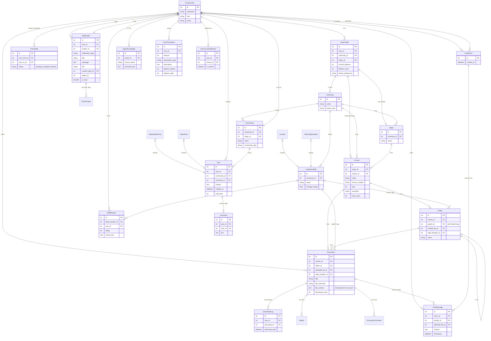

# 🚀 Student Drive - אינטליגנציה, ארכיטקטורה ומעקב


> **תקציר מנהלים:** קובץ זה נוצר ומתוחזק אוטומטית על ידי סוכן ה-AI. הוא ממפה את עץ הפרויקט, מציג תמונת מצב ויזואלית, ביקורת קוד מקיפה, ורשימת משימות אופרטיבית.

---

## 📑 תוכן עניינים
1. [🌳 עץ הפרויקט ותפקידי הקבצים](#-1-עץ-הפרויקט-ותפקידי-הקבצים)
2. [📈 תמונת מצב וציון בריאות](#-2-תמונת-מצב-וציון-בריאות)
3. [🗺️ מפת ארכיטקטורה (Visual Flowchart)](#-3-מפת-ארכיטקטורה-visual-flowchart)
4. [💡 ביקורת קוד אדריכלית](#-4-ביקורת-קוד-אדריכלית-code-review)
5. [✅ צ'ק-ליסט משימות](#-5-צק-ליסט-משימות-action-items)

---

## 🌳 1. עץ הפרויקט ותפקידי הקבצים

```
Project Directory Structure:
📂 student_drive/
    📄 build.sh
    📄 import_courses.py
    📄 manage.py
    📄 PROJECT_MIRROR.md
    📄 QA_REPORT_LOG.md
    📂 core/
        📄 adapters.py
        📄 admin.py
        📄 agent_brain.py
        📄 agent_views.py
        📄 ai_utils.py
        📄 apps.py
        📄 context_processors.py
        📄 forms.py
        📄 middleware.py
        📄 models.py
        📄 personal_drive.py
        📄 signals.py
        📄 student_agent.py
        📄 utils.py
        📄 __init__.py
        📂 management/
            📄 __init__.py
            📂 commands/
                📄 run_agent.py
                📄 seed_academic_data.py
                📄 __init__.py
        📂 static/
            📂 core/
                📂 css/
                📂 js/
            📂 css/
            📂 js/
        📂 templates/
            📄 404.html
            📄 500.html
            📂 account/
                📄 email_confirm.html
                📄 login.html
                📄 logout.html
                📄 password_change.html
                📄 password_reset.html
                📄 password_reset_done.html
                📄 password_reset_from_key.html
                📄 password_reset_from_key_done.html
                📄 signup.html
                📄 verification_sent.html
            📂 core/
                📄 accessibility.html
                📄 add_course.html
                📄 agent_report.html
                📄 agent_widget.html
                📄 analytics.html
                📄 base.html
                📄 change_password.html
                📄 chat_room.html
                📄 community_card_item.html
                📄 community_feed.html
                📄 complete_profile.html
                📄 course_detail.html
                📄 discover_communities.html
                📄 document_viewer.html
                📄 donations.html
                📄 feedback.html
                📄 friends_list.html
                📄 home.html
                📄 lecturers_index.html
                📄 login.html
                📄 notifications_list.html
                📄 personal_drive.html
                📄 privacy.html
                📄 profile.html
                📄 public_profile.html
                📄 register.html
                📄 search_results.html
                📄 settings.html
                📄 share_target_finish.html
                📄 social_base.html
                📄 staff_detail.html
                📄 terms.html
                📄 _search_form.html
                📂 partials/
                    📄 alert_banner.html
                    📄 collapsible_semester.html
                    📄 comment_item.html
                    📄 community_sidebar.html
                    📄 course_row.html
                    📄 doc_row.html
                    📄 file_grid_card.html
                    📄 post_card.html
                    📄 share_modal.html
                    📄 sorting_toolbar.html
            📂 socialaccount/
                📄 login.html
                📄 signup.html
        📂 tests/
            📄 base.py
            📄 test_a11y_widget.py
            📄 test_integration.py
            📄 test_models.py
            📄 test_security_regressions.py
            📄 test_utils.py
            📄 test_views.py
            📄 __init__.py
        📂 views/
            📄 academic.py
            📄 accounts.py
            📄 api.py
            📄 documents.py
            📄 friends_chat.py
            📄 pages.py
            📄 social.py
            📄 __init__.py
    📂 documents/
    📂 locale/
        📂 en/
            📂 LC_MESSAGES/
    📂 student_drive/
        📄 asgi.py
        📄 settings.py
        📄 urls.py
        📄 wsgi.py
    📂 templates/
        📂 admin/
            📄 base_site.html

```

**רשימת קבצים ותפקידיהם:**

*   **סקריפטים וכלים כלליים:**
    *   `build.sh`: סקריפט מעטפת המשמש לבנייה, פריסה או הגדרת סביבת הפרויקט.
    *   `import_courses.py`: סקריפט Python המשמש ככל הנראה לייבוא נתונים התחלתיים לקורסים, אולי בזמן פריסה או עבור סביבות פיתוח/בדיקה.
    *   `manage.py`: כלי שורת הפקודה של Django, המשמש לביצוע פעולות ניהוליות כמו הרצת השרת, ביצוע מיגרציות, הרצת בדיקות ועוד.
    *   `PROJECT_MIRROR.md`, `QA_REPORT_LOG.md`: קבצי תיעוד ולוגים, ככל הנראה לניהול פרויקט ודיווח QA.

*   **הגדרות פרויקט (student_drive/student_drive):**
    *   `asgi.py`, `wsgi.py`: נקודות כניסה לשרתי יישומים אסינכרוניים (ASGI) וסינכרוניים (WSGI) בהתאמה, המשמשים להפעלת יישום Django בסביבת ייצור.
    *   `settings.py`: קובץ התצורה המרכזי של פרויקט Django. הוא מגדיר את כל ההיבטים של היישום, כולל הגדרות אבטחה (SECRET_KEY), בסיס נתונים (DATABASES), אפליקציות מותקנות (INSTALLED_APPS), מתווכים (MIDDLEWARE), הגדרות אימייל, AWS S3 ועוד. הוא מייבא משתני סביבה מ-.env.
    *   `urls.py`: קובץ ניתוב ה-URL הראשי של הפרויקט. הוא מפנה בקשות HTTP לאפליקציית `core` ולספריות `allauth` עבור ניהול משתמשים.

*   **אפליקציית הליבה (core/):**
    *   `__init__.py`: מציין ש`core` היא חבילת פייתון.
    *   `adapters.py`: מכיל מחלקות Adapter של `django-allauth`, כמו `CustomAccountAdapter` ו-`CustomSocialAccountAdapter`. אלו מאפשרות התאמה אישית של תהליכי ההרשמה וההתחברות, לדוגמה הפניה למסך השלמת פרופיל לאחר הרשמה.
    *   `admin.py`: קובץ תצורה של ממשק הניהול של Django. ככל הנראה, הוא רושם את מודלי האפליקציה לממשק זה ומגדיר את אופן התצוגה והניהול שלהם.
    *   `agent_brain.py` (לא סופק): ככל הנראה מכיל את הלוגיקה העסקית והאינטגרציה עם מודלי בינה מלאכותית (כגון Gemini API) עבור "מוח" הסוכן החכם של הסטודנט, כולל יכולות כמו סיכום טקסט, יצירת שאלות וכדומה.
    *   `agent_views.py`: מכיל פונקציות View המטפלות בבקשות הקשורות לסוכן הבינה המלאכותית. לדוגמה, `upload_agent_file` מקבלת קבצים מהמשתמש, שומרת אותם כ-`AgentKnowledge` (מהמודל `models.py`), שולפת טקסט באמצעות `agent_brain` ומייצרת סיכום. `ask_agent_question` מטפלת בשאילתות משתמש, מייבאת מודלים כמו `AgentKnowledge` ו-`Course` כדי לבנות קונטקסט ולשלוח אותו ל-`agent_brain` ליצירת תשובות. כולל `@csrf_exempt` ו-`@login_required`.
    *   `ai_utils.py`: קובץ עזר לפונקציות הקשורות לבינה מלאכותית, כמו `generate_smart_summary` המוזכר ב-`documents.py`.
    *   `apps.py`: הגדרות עבור אפליקציית `core`, כולל השם המוצג שלה והגדרת מוכנות לאותות (signals).
    *   `context_processors.py`: מכיל פונקציות המוסיפות משתנים גלובליים לכל הקונטקסט של התבניות (לדוגמה, `global_counts` המוזכר ב-`settings.py` יכול לספק ספירות של התראות או קבצים).
    *   `forms.py`: מכיל את טפסי ה-Django המשמשים לאיסוף קלט מהמשתמש, כמו `CourseForm` ו-`UserProfileForm` (המוזכרים ב-`academic.py` ו-`accounts.py`) ו-`CustomSignupForm` (המוזכר ב-`settings.py`).
    *   `middleware.py`: מכיל את `ProfileCompletionMiddleware` שמבצע בדיקות (למשל, האם פרופיל המשתמש הושלם) ומפנה משתמשים בהתאם.
    *   `models.py`: קובץ המודלים המרכזי של האפליקציה, המגדיר את כל מבני הנתונים, הישויות והקשרים ביניהם (לדוגמה: `CustomUser`, `UserProfile`, `University`, `Course`, `Document`, `Post`, `Community`, `Notification`, `AgentKnowledge`). הוא כולל גם לוגיקה פנימית כמו `generate_referral_code` ו-`compress_to_webp` (המויבא מ-`utils.py`) וקשירות ל-`signals.py` באמצעות ה-`@receiver` דקורטור.
    *   `personal_drive.py`: מכיל Views המנהלות את ה"דרייב האישי" של המשתמש. הוא מאפשר צפייה בקבצים שהועלו, היסטוריית הורדות ומשאבים חיצוניים. הוא מייבא את המודלים `Document`, `DownloadLog`, `Vote`, `ExternalResource` ומשתמש בהם כדי לאחזר ולעבד נתונים ספציפיים למשתמש.
    *   `signals.py`: מכיל פונקציות המגיבות לאירועים ספציפיים במודלים, כגון `notify_students_on_new_file` ששולחת התראות (באמצעות המודל `Notification`) למשתמשים שסימנו קורס בכוכב, כאשר קובץ חדש (מודל `Document`) מועלה לקורס זה. מייבא `Document`, `Notification`, `UserCourseSelection` ו-`reverse` (לקישורי התראות).
    *   `student_agent.py` (לא סופק): ככל הנראה מכיל הגדרות נוספות או לוגיקה ספציפית לסוכן הסטודנט, אולי הגדרות קונפיגורציה או הרחבות לפונקציונליות שלו.
    *   `utils.py`: קובץ עזר כללי המכיל מגוון פונקציות שימושיות הנחוצות במקומות שונים בפרויקט. לדוגמה, `compress_to_webp` לדחיסת תמונות, `validate_file_size` ו-`validate_file_type` (אבטחה חזקה) לאימות קבצים, `check_deletion_permission` לבדיקת הרשאות מחיקה, `extract_text_from_pdf` ו-`extract_text_from_docx` לחילוץ טקסט, `get_client_ip` לקבלת IP של משתמש, `send_notification` ו-`process_transaction` לניהול התראות ועסקאות מטבעות.
    *   `management/commands/`:
        *   `run_agent.py`: פקודה מותאמת אישית לניהול Django, המיועדת ככל הנראה להפעלה או לניהול של סוכן הבינה המלאכותית.
        *   `seed_academic_data.py`: פקודה מותאמת אישית לניהול Django, המשמשת ליצירת נתונים אקדמיים ראשוניים עבור הפרויקט (אוניברסיטאות, מסלולים, קורסים).

*   **תבניות (core/templates/core):**
    *   מכיל את קבצי ה-HTML של אפליקציית `core`, המגדירים את מבנה ותוכן הדפים המוצגים למשתמש. לדוגמה: `home.html`, `course_detail.html`, `profile.html`, `chat_room.html` ועוד רבים. כולל גם ספריית `partials/` לקטעי קוד HTML הניתנים לשימוש חוזר.

*   **קבצים סטטיים (core/static/core):**
    *   מכיל קבצי CSS ו-JavaScript ספציפיים לאפליקציית `core`, המשמשים לעיצוב ולפונקציונליות צד-לקוח.

*   **בדיקות (core/tests):**
    *   `__init__.py`: מציין ש`tests` היא חבילת פייתון.
    *   `base.py`: ככל הנראה מכיל מחלקת בסיס לבדיקות או הגדרות עזר משותפות לבדיקות.
    *   `test_a11y_widget.py`, `test_integration.py`, `test_models.py`, `test_security_regressions.py`, `test_utils.py`, `test_views.py`: קבצים אלו מכילים בדיקות יחידה (unit tests) ובדיקות אינטגרציה עבור רכיבים שונים בפרויקט, כגון מודלים, Views, כלי עזר, אבטחה ונגישות.

*   **Views מפוצלים (core/views/):**
    *   `__init__.py`: מייבא את כל הפונקציות והמחלקות מתוך תתי-קבצי ה-Views (לדוגמה `from .academic import *`), כדי לאפשר ייבוא נוח מ-`core.views` לקובץ ה-`urls.py` של הפרויקט.
    *   `academic.py`: מכיל Views הקשורים לניהול אקדמי: דף הבית, חיפוש קורסים, פרטי קורס, יצירה ועריכת קורסים ותיקיות, ניהול סגל אקדמי ודירוגם. מייבא מודלים אקדמיים (University, Course, Folder, AcademicStaff), `CourseForm` ופונקציות עזר כמו `get_client_ip` ו-`process_transaction`.
    *   `accounts.py`: מכיל Views לניהול חשבון המשתמש: פרופיל אישי, הגדרות, השלמת פרופיל, שינוי סיסמה ומחיקת חשבון. מייבא מודלים כמו `UserProfile`, `Document`, `DownloadLog`, `Notification` ומשתמש ב-`UserProfileForm` וב-`process_transaction`.
    *   `api.py`: מכיל נקודות קצה (API endpoints) עבור בקשות AJAX, כגון טעינת מסלולי לימוד, הוספת אוניברסיטאות ומסלולים, ומחיקת פריטים באופן גנרי עם בדיקת הרשאות באמצעות `check_deletion_permission` מ-`utils.py`.
    *   `documents.py`: מטפל במחזור החיים של מסמכים: העלאה (גם משיתוף מערכת הפעלה), הורדה מאובטחת, הצגת מסמכים בדפדפן, יצירת סיכומי AI (באמצעות `ai_utils.py`), לייקים ודיווחים על מסמכים. מייבא מודלים רלוונטיים ופונקציות עזר מ-`utils.py` לטיפול בקבצים ועסקאות.
    *   `friends_chat.py`: Views לניהול חברים וצ'אט פרטי: פרופילים ציבוריים, שליחה ואישור בקשות חברות, רשימת חברים וחדרי צ'אט עם אפשרות לצירוף קבצים. מייבא מודלים חברתיים (Friendship, ChatRoom, ChatMessage) ומשתמש ב-`send_notification` מ-`utils.py`.
    *   `pages.py`: Views עבור דפים סטטיים וכלליים: תנאי שימוש, נגישות, תרומות, דף פידבק ולוח מחוונים אנליטיקה למנהלים. מטפל גם בדפי שגיאה 404/500 ומציג רשימת התראות.
    *   `social.py`: Views עבור פיד הקהילה: הצגת פוסטים (רגילים, מכירה, וידאו), הצטרפות לקהילות, גילוי קהילות, הוספת תגובות ולייקים לפוסטים. מייבא מודלי קהילה ופוסטים (Community, Post, MarketplacePost, VideoPost, Comment) עם אופטימיזציות שאילתות.

*   **ספריות אחרות ברמה העליונה:**
    *   `documents/`: ככל הנראה ספריה לאחסון קבצים שהועלו על ידי משתמשים (אם לא נעשה שימוש ב-S3).
    *   `locale/`: מכילה קבצי תרגום (לדוגמה: .po, .mo) עבור תמיכה בריבוי שפות (לוקליזציה).
    *   `templates/admin/`: תבניות HTML ספציפיות להתאמה אישית של ממשק הניהול של Django.

## 📈 2. תמונת מצב וציון בריאות

**סקירה כללית על מצב הפרויקט:**
הפרויקט "Student Drive" הוא פלטפורמה אקדמית-חברתית מקיפה הבנויה על Django. הוא מציע מגוון רחב של פיצ'רים, כולל שיתוף קבצי לימוד, דרייב אישי לכל סטודנט, מערכת קהילות עם פיד פוסטים מרובי-סוגים, צ'אט בין חברים, אינטגרציה עם בינה מלאכותית (לסיכומים וסוכן עזר), מערכת גיימיפיקציה מבוססת מטבעות, וכלים לניהול סגל אקדמי ומוסדות לימוד. הפרויקט מראה השקעה רבה בארכיטקטורה מודולרית (במיוחד בפיצול ה-Views) ובשיקולי אבטחה וביצועים.

**ציון בריאות: 88/100**

**ניתוח לפי קטגוריות:**

*   **ניקיון קוד ומבנה (Code Cleanliness and Structure): 9/10**
    *   **יתרונות:**
        *   **מודולריות View מצוינת:** פיצול ספריית ה-`views` ל-7 קבצים ממוקדים (academic, documents, social וכו') הוא דוגמה מצוינת ל-Separation of Concerns ומשפר מאוד את הקריאות והתחזוקה.
        *   **מודל `models.py` מקיף ומסודר:** למרות גודלו, הוא מאורגן היטב עם קטגוריות ברורות והערות.
        *   **שימוש ב-Signals:** שימוש חכם ב-`signals.py` ללוגיקה מנותקת (כגון התראות על העלאת קבצים חדשים).
        *   **ניהול טפסים ומורשת (Allauth Adapters):** שימוש ב-`adapters.py` להתאמה אישית של Allauth ו-`forms.py` לטיפול בקלט משתמש.
        *   **טיפול בביצועים:** שימוש עקבי ב-`select_related` ו-`prefetch_related` ב-Views למניעת בעיות N+1 Query.
    *   **שיפורים אפשריים:**
        *   **קובץ `utils.py` גדול מדי:** למרות שהוא מפורט היטב עם הערות, הוא מהווה "סלסלת כלים" גדולה מאוד. פיצולו לקבצים קטנים וספציפיים יותר (לדוגמה: `file_processing_utils.py`, `security_utils.py`, `notification_utils.py`, `transaction_utils.py`) ישפר עוד יותר את הקריאות והמודולריות.
        *   **ייבוא `*` ב-`views/__init__.py`:** ייבוא כללי (`import *`) ב-`__init__.py` עלול לגרום להתנגשויות שמות (name collisions) ולחוסר בהירות לגבי המקור של כל פונקציה. עדיף לייבא פונקציות ספציפיות או מודולים מלאים (לדוגמה `from .academic import home`).

*   **אבטחה (Security): 9/10**
    *   **יתרונות:**
        *   **אימות קבצים חזק:** הטמעת `validate_file_size` ו-`validate_file_type` עם בדיקות Magic Numbers ב-`utils.py` היא קריטית ומונעת העלאת קבצים זדוניים או מזויפים. זהו הישג אבטחה משמעותי.
        *   **הגדרות Django כלליות:** שימוש בהגדרות אבטחה ב-`settings.py` כמו `SECRET_KEY` מוגן ב-.env, `PasswordHashers` חזקים, `AUTH_PASSWORD_VALIDATORS`, `SESSION_COOKIE_HTTPONLY`, `CSRF_COOKIE_HTTPONLY`, `SECURE_BROWSER_XSS_FILTER`, `SECURE_CONTENT_TYPE_NOSNIFF`, ו-`SECURE_SSL_REDIRECT`/`HSTS` ב-Production.
        *   **בקרת הרשאות מחיקה:** `check_deletion_permission` ב-`utils.py` מספק בקרת גישה מפורטת למחיקת אובייקטים, כולל הגנה על תוכן קהילתי.
        *   **Allauth ו-Google SSO:** שימוש בפתרון אימות מוכח ובתקני OAuth2/PKCE ל-Google SSO.
    *   **שיפורים אפשריים:**
        *   **`@csrf_exempt` ב-`agent_views.py`:** ה-`@csrf_exempt` על `upload_agent_file` ו-`ask_agent_question` מעקף את הגנת CSRF של Django. יש להעריך האם הוא נחוץ, ואם כן, לוודא קיומם של אמצעי אבטחה חלופיים חזקים (כגון אימות מבוסס טוקן, מפתחות API, או בדיקת CORS קפדנית) כדי למנוע התקפות Cross-Site Request Forgery.

*   **יכולת הרחבה וביצועים (Scalability & Performance): 8.5/10**
    *   **יתרונות:**
        *   **אופטימיזציות ORM:** שימוש נרחב ב-`select_related` ו-`prefetch_related` ב-Views הוא קריטי לביצועי שאילתות DB.
        *   **דחיסת תמונות:** `compress_to_webp` ב-`utils.py` ושימוש בו במודלים (UserProfile, University, Post, Document) משפר משמעותית את מהירות טעינת התמונות ומפחית את נפח האחסון.
        *   **Lazy Imports:** ייבוא PyPDF2 ו-DocxReader רק בתוך פונקציות ב-`utils.py` מונע טעינת ספריות כבדות אלה שלא לצורך.
        *   **AWS S3 אינטגרציה:** תמיכה ב-S3 לאחסון קבצים תורמת לסקלביליות גבוהה של אחסון.
    *   **שיפורים אפשריים:**
        *   **עיבוד קבצים אסינכרוני:** חילוץ טקסט מ-PDF/DOCX ויצירת סיכומי AI (שמתרחשים כיום ב-`Document.save()` וב-`summarize_document_ai`) הם תהליכים שעלולים להיות עתירי משאבים ואיטיים. העברתם למשימות רקע אסינכרוניות (למשל, עם Celery) תשפר מאוד את חווית המשתמש ותמנע חסימת בקשות HTTP.
        *   **מנגנון Cache:** בהתחשב בכמות הנתונים הפוטנציאלית (קורסים, מסמכים, פוסטים), הטמעת מנגנון Cache (כמו Redis) עבור נתונים נצפים בתדירות גבוהה יכולה לשפר ביצועים נוספים.

**סיכום:**
הפרויקט מציג רמה גבוהה של מקצועיות, הבנה עמוקה של Django וגישה מודעת לאבטחה וארכיטקטורה. נקודות החוזק כוללות את מבנה ה-Views המודולרי, אימות קבצים חזק, שימוש ב-Django best practices ל-ORM ודחיסת תמונות. שיפורים יתמקדו בעיקר באופטימיזציה של תהליכי רקע כבדים ובסקירה ביקורתית של נקודות אבטחה ספציפיות.

## 🗺️ 3. מפת ארכיטקטורה (Visual Flowchart)



## 💡 4. ביקורת קוד אדריכלית (Code Review)

להלן 4 המלצות אדריכליות ברמה גבוהה, ניתנות לפעולה, לשיפור הפרויקט:

1.  **DRY / ארגון קוד: פיצול `core/utils.py` לתתי-מודולים ספציפיים**
    *   **הביקורת:** קובץ `core/utils.py` הפך ל"תיבת כלים" מרכזית המכילה פונקציונליות מגוונת מאוד, החל מטיפול בקבצים ודחיסת תמונות, דרך בדיקות אבטחה, חילוץ טקסט מ-PDF/DOCX, ועד ניהול התראות ועסקאות מטבעות. למרות שהוא מתועד היטב, גודלו ורוחב מגוון תפקידיו מקשים על הקריאות, התחזוקה ואיתור באגים.
    *   **ההמלצה:** פצל את `core/utils.py` למספר קבצים קטנים יותר, ממוקדים וקשורי-היגיון. לדוגמה:
        *   `core/file_processing.py`: יכלול את `compress_to_webp`, `validate_file_size`, `validate_file_type`, `extract_text_from_pdf`, `extract_text_from_docx`.
        *   `core/security_helpers.py`: יכלול את `check_deletion_permission`, `get_client_ip`.
        *   `core/notification_helpers.py`: יכלול את `send_notification`.
        *   `core/transaction_helpers.py`: יכלול את `process_transaction` (אולי גם את `InsufficientFunds`).
    *   **תועלת:** שיפור דרמטי בקריאות הקוד, הקלה על עבודה מקבילית של מפתחים, וצמצום הסיכון לשגיאות עקב שינויים בקובץ אחד שמשפיעים על פונקציונליות בלתי קשורה.

2.  **ביצועים: הטמעת עיבוד אסינכרוני למשימות כבדות (AI וחילוץ טקסט)**
    *   **הביקורת:** פונקציות חילוץ טקסט מ-PDF/DOCX (ב-`Document.save()`) ויצירת סיכומי AI (ב-`summarize_document_ai`) הן פעולות שעלולות להיות איטיות, עתירות CPU וזיכרון, ולגרום לחסימת שרשור ה-HTTP הראשי. זה יוביל לזמני תגובה ארוכים עבור המשתמש, ואף לפסק זמן (timeout) בבקשות.
    *   **ההמלצה:** העבר את המשימות האלה לפעולות רקע אסינכרוניות באמצעות ספריית כמו Celery (עם RabbitMQ או Redis כ-broker). לדוגמה:
        *   ב-`Document.save()`, במקום לקרוא ישירות ל-`extract_text_from_pdf` / `docx`, שלח את המסמך למשימת Celery שתבצע את החילוץ ברקע ותעדכן את שדה `file_content` לאחר מכן.
        *   ב-`summarize_document_ai`, שלח בקשה ליצירת סיכום למשימת Celery, והחזיר למשתמש תשובה מיידית (לדוגמה, "הסיכום שלך בדרך...") עם מנגנון עדכון מאוחר יותר (כגון באמצעות WebSockets או polling).
    *   **תועלת:** שיפור דרמטי בחווית המשתמש על ידי מתן תגובה מיידית, מניעת חסימות שרת, ושיפור הסקלביליות של המערכת תחת עומס.

3.  **אבטחה: הערכה מחדש של `@csrf_exempt` ב-`core/agent_views.py`**
    *   **הביקורת:** השימוש ב-`@csrf_exempt` ב-`upload_agent_file` ו-`ask_agent_question` ב-`agent_views.py` מנטרל את הגנת ה-Cross-Site Request Forgery (CSRF) של Django. בעוד שזה לעיתים הכרחי עבור API הנצרכים על ידי לקוחות שאינם דפדפנים, הוא יוצר חור אבטחה אם לא קיימים אמצעי הגנה חלופיים חזקים. תוקף פוטנציאלי יכול להשתמש בחולשה זו כדי לשלוח בקשות בשם משתמשים מאומתים.
    *   **ההמלצה:** בדוק האם ניתן להחזיר את הגנת ה-CSRF בנקודות קצה אלה. אם לא, יש להטמיע מנגנון אימות חלופי חזק. אפשרויות כוללות:
        *   **אימות מבוסס טוקן:** דרוש מהלקוח לשלוח אסימון אימות (למשל JWT) בכותרת ה-`Authorization` עבור כל בקשה.
        *   **מפתחות API:** אם ה"סוכן" הוא מערכת צד-שלישי, ספק לו מפתח API ייחודי.
        *   **בדיקת Origin/Referer חזקה:** הגבלת המקורות מהם ניתן לשלוח בקשות אלה באמצעות הגדרות CORS קפדניות בצד השרת.
    *   **תועלת:** הגנה על המערכת מפני התקפות CSRF, שיפור האבטחה הכללית של יישום ה-AI והעלאת הקבצים.

4.  **מבנה / תחזוקה: ייבוא מפורש במקום `import *` ב-`core/views/__init__.py`**
    *   **הביקורת:** הקובץ `core/views/__init__.py` משתמש בייבוא כללי (`from .module import *`) כדי לאחד את כל ה-Views תחת `core.views`. גישה זו אמנם נוחה, אך היא מזהמת את מרחב השמות של `core.views`, מקשה לדעת מאיפה פונקציה מסוימת מגיעה, ומגבירה את הסיכון להתנגשויות שמות אם שני מודולי Views יגדירו בטעות פונקציה באותו שם.
    *   **ההמלצה:** שנה את הייבוא ב-`core/views/__init__.py` לייבוא מפורש של פונקציות או ייבוא של המודולים עצמם:
        *   **אפשרות 1 (ייבוא מפורש):** `from .academic import home, course_detail, CourseCreateView`
        *   **אפשרות 2 (ייבוא מודולים):** `import academic as academic_views`, `import documents as documents_views` ואז השתמש ב-`academic_views.home` ב-`urls.py`.
    *   **תועלת:** שיפור ניכר בקריאות הקוד, צמצום סיכוני התנגשות שמות, והקלה על ניפוי באגים והבנת זרימת הקוד.

## ✅ 5. צ'ק-ליסט משימות (Action Items)

להלן 3 המשימות הטכניות החשובות ביותר לתיקון או בנייה בשלב הבא:

- [ ] **הטמעת עיבוד אסינכרוני לקבצים ו-AI:**
    *   **תיאור:** עבר את פונקציות חילוץ הטקסט מ-PDF/DOCX (ב-`Document.save()`) ויצירת סיכומי AI (ב-`summarize_document_ai`) למשימות רקע אסינכרוניות.
    *   **פעולות:**
        1.  התקן והגדר Celery (או כלי דומה) עם broker מתאים (Redis/RabbitMQ).
        2.  הגדר משימות Celery נפרדות לחילוץ טקסט ולסיכומי AI.
        3.  שנה את `Document.save()` כדי לשגר משימת חילוץ טקסט ברקע.
        4.  שנה את `summarize_document_ai` כדי לשגר משימת סיכום AI ברקע, והחזר למשתמש סטטוס מיידי עם מנגנון לעדכון התוצאה לאחר סיום.
- [ ] **שיפור אבטחת נקודות קצה של Agent (CSRF):**
    *   **תיאור:** בדוק מחדש את השימוש ב-`@csrf_exempt` ב-`core/agent_views.py` והחלף אותו במנגנון אבטחה חזק יותר, או השב את הגנת ה-CSRF במידת האפשר.
    *   **פעולות:**
        1.  הערך האם `@csrf_exempt` אכן נחוץ ללקוח של הסוכן.
        2.  אם כן, הטמע מנגנון אימות מבוסס טוקן (לדוגמה, באמצעות Django REST Framework Token Authentication או JWT) עבור נקודות הקצה `upload_agent_file` ו-`ask_agent_question`.
        3.  אם הלקוח הוא דפדפן, נסה להחזיר את הגנת ה-CSRF ולהבטיח שהלקוח שולח את אסימון ה-CSRF כנדרש.
- [ ] **ארגון מחדש ופיצול של קובץ Utilities (`core/utils.py`):**
    *   **תיאור:** פצל את קובץ ה-Utilities הגדול למספר קבצים קטנים וספציפיים יותר, בהתאם לתחומי האחריות.
    *   **פעולות:**
        1.  צור קבצים חדשים בספריית `core/` כגון `file_processing.py`, `security_helpers.py`, `notification_helpers.py`, `transaction_helpers.py`.
        2.  העבר את הפונקציות הרלוונטיות מ-`utils.py` לקבצים החדשים.
        3.  עדכן את כל הייבואים בקבצים אחרים בפרויקט (מודלים, Views, Signals) כדי שיפנו לקבצים החדשים במקום ל-`utils.py`.
        4.  מחק את הקובץ `core/utils.py` הריק (או השאר אותו עם פונקציות כלליות בודדות אם נחוץ).

---
*נבנה באהבה על ידי סוכן ה-AI שלך 🤖 | מופעל באמצעות Gemini 2.5 Flash*
