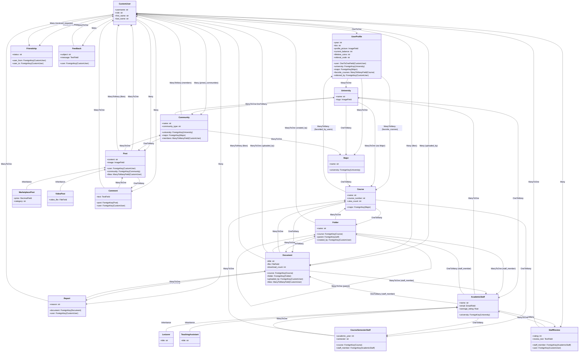

# 🚀 Student Drive - אינטליגנציה, ארכיטקטורה ומעקב


> **תקציר מנהלים:** קובץ זה נוצר ומתוחזק אוטומטית על ידי סוכן ה-AI. הוא ממפה את עץ הפרויקט, מציג תמונת מצב ויזואלית, ביקורת קוד מקיפה, ורשימת משימות אופרטיבית.

---

## 📑 תוכן עניינים
1. [🌳 עץ הפרויקט ותפקידי הקבצים](#-1-עץ-הפרויקט-ותפקידי-הקבצים)
2. [📈 תמונת מצב וציון בריאות](#-2-תמונת-מצב-וציון-בריאות)
3. [🗺️ מפת ארכיטקטורה (Visual Flowchart)](#-3-מפת-ארכיטקטורה-visual-flowchart)
4. [💡 ביקורת קוד אדריכלית](#-4-ביקורת-קוד-אדריכלית-code-review)
5. [✅ צ'ק-ליסט משימות](#-5-צק-ליסט-משימות-action-items)

---

## 🌳 1. עץ הפרויקט ותפקידי הקבצים

```
📂 student_drive/
    📄 build.sh
    📄 import_courses.py
    📄 manage.py
    📂 core/
        📄 admin.py
        📄 ai_utils.py
        📄 apps.py
        📄 context_processors.py
        📄 forms.py
        📄 models.py
        📄 tests.py
        📄 views.py
        📄 __init__.py
        📂 management/
            📄 __init__.py
            📂 commands/
                📄 load_bgu_courses.py
                📄 run_agent.py
                📄 seed_bgu_ee.py
                📄 __init__.py
        📂 static/
            📂 css/
            📂 js/
        📂 templates/
            📄 404.html
            📄 500.html
            📂 account/
            📂 core/
            📂 partials/
            📂 socialaccount/
    📂 documents/
    📂 locale/
        📂 en/
            📂 LC_MESSAGES/
    📂 student_drive/
        📄 asgi.py
        📄 settings.py
        📄 urls.py
        📄 wsgi.py
    📂 templates/
        📂 admin/
            📄 base_site.html
```

---

**פירוט קבצים ותפקידיהם:**

**1. קבצי שורש הפרויקט (`student_drive/`)**

*   `build.sh`: סקריפט Bash המשמש ככל הנראה לתהליכי Build ו-Deployment, כגון התקנת תלויות, הרצת מייגרציות, או איסוף קבצים סטטיים. הוא חיוני לאוטומציה של פריסת הפרויקט.
*   `import_courses.py`: סקריפט פיתון חיצוני, כנראה מיועד לייבוא נתוני קורסים מורכבים למסד הנתונים, אולי מקובץ CSV או API. מתחבר למודלים ב-`core/models.py`.
*   `manage.py`: כלי שורת הפקודה הראשי של Django. מאפשר לבצע פעולות ניהוליות כמו הרצת השרת, ביצוע מייגרציות וקיום פקודות מותאמות אישית.
*   `documents/`: תיקייה זו, אם אינה מוגדרת לאחסון ענן (S3), תשמש לאחסון קבצי מדיה (כגון מסמכים ותמונות פרופיל) שהועלו על ידי משתמשים. מקושרת לשדה `FileField` במודלים כמו `Document` ו-`UserProfile`.
*   `locale/`: תיקייה זו מכילה קבצי תרגום (לוקליזציה) של הפרויקט, המאפשרים תמיכה בשפות שונות. מתחברת להגדרות `LANGUAGE_CODE`, `USE_I18N`, `LOCALE_PATHS` ב-`settings.py`.

**2. תיקיית פרויקט Django (`student_drive/student_drive/`)**

*   `asgi.py`: נקודת כניסה ליישומי ASGI (Asynchronous Server Gateway Interface) עבור שרתי ווב אסינכרוניים, כגון Daphne או Uvicorn. רלוונטי לשימושים כמו WebSockets או משימות ארוכות טווח.
*   `settings.py`: קובץ התצורה הגלובלי של הפרויקט. הוא מגדיר את כל הפרמטרים החשובים כמו חיבור למסד נתונים, אפליקציות מותקנות, מפתחות סודיים, הגדרות אבטחה, נתיבי קבצים סטטיים ומדיה, הגדרות אימות ואימייל, ועוד. משפיע על כל היבט בפרויקט.
*   `urls.py`: קובץ ניתוב ה-URL הראשי של הפרויקט. הוא מפנה בקשות HTTP לאפליקציות השונות ולפונקציות ה-View המתאימות. מתחבר ל-`views.py` באפליקציות.
*   `wsgi.py`: נקודת כניסה ליישומי WSGI (Web Server Gateway Interface) עבור שרתי ווב סינכרוניים, כגון Gunicorn או Apache/Nginx עם mod_wsgi.

**3. אפליקציית `core` (`student_drive/core/`)**

*   `admin.py`: קובץ המגדיר כיצד מודלים יופיעו בממשק הניהול של Django. מאפשר הוספה, עריכה ומחיקה של נתונים בקלות למנהלים. מתחבר ל-`models.py`.
*   `ai_utils.py`: מודול המכיל פונקציות עזר הקשורות לבינה מלאכותית, כגון `generate_smart_summary`. מתחבר ל-`views.py` לביצוע פעולות AI ול-`settings.py` עבור מפתחות API (כמו `GEMINI_API_KEY`).
*   `apps.py`: קובץ תצורה לאפליקציה `core`. מגדיר שם לאפליקציה, וניתן להשתמש בו להגדרת אותות (Signals) או אתחול ספציפי לאפליקציה.
*   `context_processors.py`: מודול המכיל פונקציות שמוסיפות נתונים גלובליים לכל הקונטקסט של התבניות. לדוגמה, `pending_reports_count` המספק נתונים על דוחות ממתינים לכל תבנית. מתחבר ל-`settings.py` ול-`models.py`.
*   `forms.py`: מודול המכיל טפסי Django המיועדים לקליטת קלט ממשתמשים, אימות נתונים ויצירת מודלים. מכיל טפסים כמו `DocumentUploadForm`, `CourseForm`, `UserProfileForm` ו-`CustomSignupForm`. מתחבר ל-`models.py` ומשמש ב-`views.py`.
*   `models.py`: ליבת המידע של הפרויקט. מגדיר את כל מודלי מסד הנתונים (כמו `CustomUser`, `Course`, `Document`, `Post` וכו'), את הקשרים ביניהם, לוגיקה עסקית ספציפית למודל (כגון שיטות `earn_coins`, `spend_coins`) ואותות (Signals) לביצוע פעולות אוטומטיות כמו יצירת `UserProfile` אוטומטית.
*   `tests.py`: קובץ המכיל בדיקות יחידה (Unit Tests) ובדיקות אינטגרציה עבור האפליקציה. חיוני לאבטחת איכות הקוד ויציבות המערכת.
*   `views.py`: מודול המכיל את לוגיקת הטיפול בבקשות HTTP (View Functions). כל פונקציה מקבלת בקשה, מבצעת פעולות (לדוגמה, שליפה או שמירת נתונים מהמודלים, אימות טפסים), ומחזירה תגובת HTTP (בדרך כלל rendering של תבנית). זהו הקשר בין ה-URLs לבין המודלים והתבניות.
*   `__init__.py`: קובץ ריק המציין שזוהי חבילת פייתון, המאפשר ייבוא מודולים מתוכה.
*   `management/commands/`: תיקייה זו מכילה פקודות ניהול מותאמות אישית של Django.
    *   `load_bgu_courses.py`: פקודה לטעינת קורסים של אוניברסיטת בן-גוריון.
    *   `run_agent.py`: פקודה להרצת סוכן אוטומטי, אולי ליצירת דוחות או משימות רקע אחרות.
    *   `seed_bgu_ee.py`: פקודה לאכלוס נתונים (Seeding) של קורסים בתחום הנדסת חשמל בבן-גוריון.
    *   `__init__.py`: מציין שהיא חבילת פייתון.
*   `static/`: מכיל קבצים סטטיים ייחודיים לאפליקציה `core` כגון קבצי CSS ו-JavaScript. מתחברים ל-`settings.py` ולתבניות HTML.
*   `templates/`: מכיל תבניות HTML ספציפיות לאפליקציה `core`. אלו קבצי ה-HTML שנשלפים וממולאים בנתונים על ידי פונקציות ה-View.
    *   `404.html`, `500.html`: תבניות ייעודיות לדפי שגיאה.
    *   `account/`, `socialaccount/`: תבניות המותאמות למערכת `django-allauth`.
    *   `core/`: תבניות הליבה של האפליקציה (לדוגמה: `home.html`, `profile.html`, `course_detail.html`).
    *   `partials/`: תבניות חלקיות (components) לשימוש חוזר בתבניות אחרות (לדוגמה: `alert_banner.html`, `post_card.html`).

**4. תיקיית תבניות גלובלית (`student_drive/templates/`)**

*   `admin/base_site.html`: תבנית המשמשת לדריסה (override) של תבנית ה-admin הדיפולטיבית של Django, ומאפשרת התאמה אישית של מראה ממשק הניהול.

---

## 📈 2. תמונת מצב וציון בריאות

הפרויקט "Student Drive" מציג פלטפורמה אקדמית-חברתית עשירה, המשלבת שיתוף מסמכים, ניהול קורסים, קהילות סטודנטים, מערכת מוניטין/מטבעות ואפילו יכולות AI לסיכום מסמכים. הארכיטקטורה מבוססת Django עם דגש על חווית משתמש עשירה (לדוגמה, BaseStyledModelForm, אימות חיבורי חברות). הפרויקט מראה ניסיון רב לשלב פיצ'רים מורכבים במקום אחד.

**ציון בריאות: 75/100**

**נימוקים:**

*   **ניקיון קוד (Cleanliness):**
    *   **חוזקות:** יש הפרדה יחסית טובה בין מודלים, טפסים ותצוגות. השימוש ב-`BaseStyledModelForm` הוא דוגמה מצוינת ל-DRY (Don't Repeat Yourself) ולניקיון קוד תבניתי. המודלים מסודרים לפי קטגוריות ברורות עם הערות בעברית. שימוש ב-`get_user_model()` ו-`select_related`/`prefetch_related` במקומות מסוימים מעיד על מודעות.
    *   **חולשות:** חלק מה-Views (כמו `course_detail`) גדולים ומטפלים ביותר מדי לוגיקה (יצירת תיקיות, עריכת תיקיות, העלאת קבצים). זה מקשה על קריאות ותחזוקה. חלק מהלוגיקה ב-`home` view יכולה להיות פשוטה יותר.
*   **אבטחה (Security):**
    *   **חוזקות:** שימוש ב-`AbstractUser` וב-`UserProfile` להרחבת מודל המשתמש הדיפולטיבי הוא גישה נכונה. הגדרות כמו `SESSION_COOKIE_HTTPONLY`, `CSRF_COOKIE_HTTPONLY`, `SECURE_BROWSER_XSS_FILTER`, `SECURE_CONTENT_TYPE_NOSNIFF`, `PASSWORD_HASHERS` (Argon2) ו-`SECURE_SSL_REDIRECT` (ב-`DEBUG=False`) מצוינות ומעידות על מודעות גבוהה לאבטחה. שילוב `django-allauth` ו-Google Social Auth עם PKCE משפר את אבטחת האימות.
    *   **חולשות:** `ACCOUNT_LOGOUT_ON_GET = True` ו-`SOCIALACCOUNT_LOGIN_ON_GET = True` הם חורי אבטחה ידועים (CSRF Logout/Login). יש לתקן אותם באופן מיידי. ה-`SITE_ID = 2` הוא קונפיגורציה פוטנציאלית לבעיות אם הפרויקט אמור לתמוך בריבוי אתרים או אם ה-Site ID אינו מוגדר כראוי במאגר.
*   **מבנה (Structure):**
    *   **חוזקות:** הפרויקט מאורגן היטב בתוך אפליקציית `core` עם הפרדה הגיונית (מודלים, תצוגות, טפסים, פקודות ניהול, קבצים סטטיים ותבניות). קיומן של פקודות ניהול מותאמות אישית ותיקיות `static`/`templates` ייעודיות לאפליקציה תורם למודולריות. השימוש ב-`.env` וב-`dj_database_url` לניהול משתני סביבה מצוין.
    *   **חולשות:** ה-`core/models.py` הוא קובץ גדול מאוד. למרות ההערות והחלוקה לסקשנים, אפשר לשקול פיצול למודולים קטנים יותר עבור מודלים שונים (לדוגמה, `users_models.py`, `academic_models.py`, `community_models.py`) כדי לשפר את הניווט והתחזוקה. התיקייה `documents/` ברמת השורש, אם לא מטופלת על ידי S3 ב-Production, דורשת הגנה מתאימה.

לסיכום, הפרויקט שאפתני וכולל פיצ'רים רבים, עם בסיס אבטחתי טוב ברוב ההיבטים. הנקודות העיקריות לשיפור הן באבטחה הקריטית של `ACCOUNT_LOGOUT_ON_GET` ובניקיון/פיצול של תצוגות ומודלים גדולים.

## 🗺️ 3. מפת ארכיטקטורה (Visual Flowchart)



## 💡 4. ביקורת קוד אדריכלית (Code Review)

*   🔴 **קריטי (Security/Bugs)**
    *   **הגדרות `ACCOUNT_LOGOUT_ON_GET` ו-`SOCIALACCOUNT_LOGIN_ON_GET`:** הגדרת `ACCOUNT_LOGOUT_ON_GET = True` ו-`SOCIALACCOUNT_LOGIN_ON_GET = True` ב-`settings.py` מהווה סיכון אבטחתי חמור (CSRF Logout/Login). תוקף יכול לגרום למשתמש להתנתק או להתחבר לחשבון אחר פשוט על ידי הטמעת תמונת פיקסל (או בקשת GET אחרת) באתר צד שלישי.
        *   **המלצה:** שנה את שתי ההגדרות ל-`False`. פעולות אלה חייבות להתבצע באמצעות בקשות POST בלבד.
    *   **טיפול בשגיאות 404/500:** פונקציות ה-`error_404` ו-`error_500` ב-`core/views.py` אינן מעבירות את אובייקט ה-`request` לקונטקסט. הדבר יגרום לכך ש-context processors (כמו `pending_reports_count`) לא יפעלו בתבניות השגיאה, ויכול להוביל לשגיאות ריצה או חוסר מידע.
        *   **המלצה:** שנה את חתימת הפונקציות וההחזר כך שיכללו את ה-`request` בקונטקסט:
            `return render(request, '404.html', status=404, context={'request': request})`.
    *   **לוגיקת מטבעות ב-AI Summarization:** פונקציית `summarize_document_ai` מכילה קוד מוער (קומנטס) הקשור לחיוב וזיכוי מטבעות. אם קוד זה יופעל, עליו להיבדק היטב לוודא שאינו יוצר חולשות או לולאות חיוב/זיכוי בלתי רצויות. הקומנטס מעידים על תכונה לא גמורה עם השלכות כספיות.
        *   **המלצה:** השלם את לוגיקת החיוב/זיכוי עבור AI Summarization, וודא שהיא נבדקת היטב ומוגנת מפני שימוש לרעה או ניצול לרעה.

*   🟡 **שיפור ביצועים (Optimization)**
    *   **N+1 Queries ב-`global_search`:** ב-`global_search` view, שליפת המסמכים (`documents`) והקורסים (`courses`) אינה משתמשת ב-`select_related` או `prefetch_related` עבור קשרי גומלין נפוצים (כמו `course` עבור מסמכים, או `major` עבור קורסים). הדבר עלול ליצור בעיית N+1 Queries כאשר מנסים לגשת לשדות אלה בתבנית עבור כל אובייקט.
        *   **המלצה:** הוסף `select_related` או `prefetch_related` לשאילתות הרלוונטיות, לדוגמה:
            `documents = Document.objects.filter(...).select_related('course', 'uploaded_by')`
            `courses = Course.objects.filter(...).select_related('major__university')`
    *   **פעולות אסינכרוניות לסיכום AI:** פונקציית `summarize_document_ai` קוראת ל-`generate_smart_summary(d.file.path)`. פעולות AI וקריאת קבצים יכולות להיות חסומות ואיטיות, מה שיגרום ל-View לחסום את שרשור השרת הראשי (Main Thread) ולפגוע בביצועים ובמדרגיות המערכת.
        *   **המלצה:** הטמע מערכת תורים (Task Queue) כמו Celery, והעבר את הקריאה ל-`generate_smart_summary` למשימת רקע אסינכרונית. המשתמש יכול לקבל אינדיקציה שהסיכום מתבצע ולקבל התראה כשהוא מוכן.

*   🟢 **ניקיון קוד (Clean Code / DRY)**
    *   **פיצול ה-`course_detail` View:** ה-`course_detail` view ב-`core/views.py` הוא ארוך ומטפל במגוון רחב של פעולות POST (יצירת תיקייה, עריכת תיקייה, העלאת קבצים). זה מפר את עקרון האחריות היחידה (Single Responsibility Principle) ומקשה על קריאות, בדיקה ותחזוקה.
        *   **המלצה:** פצל את ה-`course_detail` view לפונקציות View קטנות וייעודיות יותר (או Class-Based Views) לכל פעולה, או השתמש ב-Django REST Framework ליצירת API לכל פעולה במקום POST Form אחד ענק.
    *   **פיצול `core/models.py`:** קובץ `core/models.py` ענק ומכיל מעל 400 שורות קוד עם 20+ מודלים. למרות שיש חלוקה סמנטית באמצעות הערות, גודל הקובץ מקשה על ניווט ותחזוקה.
        *   **המלצה:** פצל את המודלים למודולים קטנים וספציפיים יותר בתוך תיקיית `core/models/`, לדוגמה: `core/models/users.py`, `core/models/academic.py`, `core/models/community.py`, וכן הלאה. ייבא אותם ל-`core/models/__init__.py` כדי לשמור על הייבוא הנוכחי.

## ✅ 5. צ'ק-ליסט משימות (Action Items)

- [x] **תקן את חורי האבטחה ב-`settings.py`**:
    - [ ] שנה את `ACCOUNT_LOGOUT_ON_GET = True` ל-`False`.
    - [ ] שנה את `SOCIALACCOUNT_LOGIN_ON_GET = True` ל-`False`.
    - **חשיבות:** קריטי, מונע התקפות CSRF שיכולות לפגוע באבטחת המשתמשים.
- [ ] **פצל את ה-`course_detail` View למרכיבים קטנים יותר**:
    - [ ] צור View חדש (או API endpoint) עבור "יצירת תיקייה".
    - [ ] צור View חדש (או API endpoint) עבור "עריכת תיקייה".
    - [ ] צור View חדש (או API endpoint) עבור "העלאת קבצים מהירה".
    - **חשיבות:** קריטי/ביצועים, ישפר דרמטית את קריאות הקוד, יכולת התחזוקה, הבדיקות ויכולת המדרגיות.
- [ ] **הטמע עיבוד אסינכרוני למשימות AI וקריאת קבצים**:
    - [ ] שלב מערכת תורים (כגון Celery) בפרויקט.
    - [ ] העבר את הקריאה ל-`generate_smart_summary` ופעולות קריאת קבצים דומות (לדוגמה, חישוב גודל קובץ אם הוא חוסם) למשימות רקע אסינכרוניות.
    - **חשיבות:** ביצועים, ימנע חסימת שרשור השרת הראשי וישפר את חווית המשתמש בזמני תגובה.

---
*נבנה באהבה על ידי סוכן ה-AI שלך 🤖 | מופעל באמצעות Gemini 2.5 Flash*
