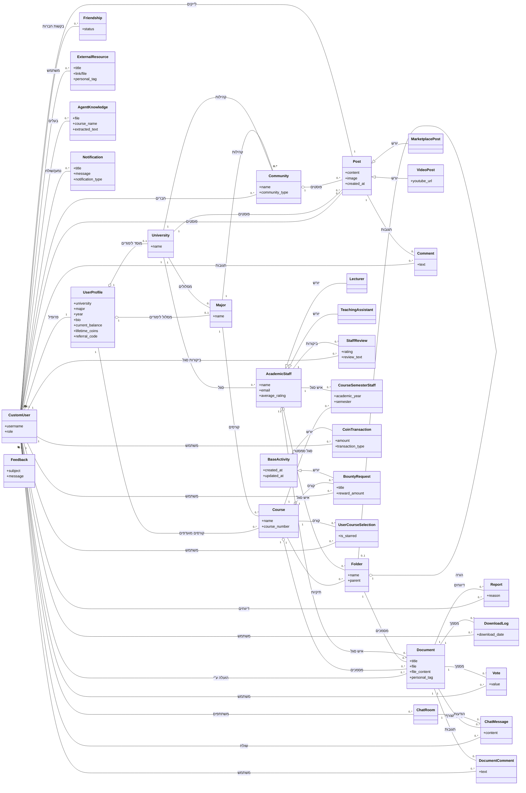

# 🚀 Student Drive - אינטליגנציה, ארכיטקטורה ומעקב


> **תקציר מנהלים:** קובץ זה נוצר ומתוחזק אוטומטית על ידי סוכן ה-AI. הוא ממפה את עץ הפרויקט, מציג תמונת מצב ויזואלית, ביקורת קוד מקיפה, ורשימת משימות אופרטיבית.

---

## 📑 תוכן עניינים
1. [🌳 עץ הפרויקט ותפקידי הקבצים](#-1-עץ-הפרויקט-ותפקידי-הקבצים)
2. [📈 תמונת מצב וציון בריאות](#-2-תמונת-מצב-וציון-בריאות)
3. [🗺️ מפת ארכיטקטורה (Visual Flowchart)](#-3-מפת-ארכיטקטורה-visual-flowchart)
4. [💡 ביקורת קוד אדריכלית](#-4-ביקורת-קוד-אדריכלית-code-review)
5. [✅ צ'ק-ליסט משימות](#-5-צק-ליסט-משימות-action-items)

---

## 🌳 1. עץ הפרויקט ותפקידי הקבצים

```
📂 student_drive/
    📄 build.sh
    📄 import_courses.py
    📄 manage.py
    📄 PROJECT_MIRROR.md
    📂 core/
        📄 adapters.py
        📄 admin.py
        📄 agent_brain.py
        📄 agent_views.py
        📄 ai_utils.py
        📄 apps.py
        📄 context_processors.py
        📄 forms.py
        📄 middleware.py
        📄 models.py
        📄 personal_drive.py
        📄 signals.py
        📄 student_agent.py
        📄 tests.py
        📄 utils.py
        📄 __init__.py
        📂 management/
            📄 __init__.py
            📂 commands/
                📄 run_agent.py
                📄 seed_academic_data.py
                📄 __init__.py
        📂 static/
            📂 core/
                📂 css/
                📂 js/
            📂 css/
            📂 js/
        📂 templates/
            📄 404.html
            📄 500.html
            📂 account/
                📄 email_confirm.html
                📄 login.html
                📄 logout.html
                📄 password_change.html
                📄 password_reset.html
                📄 signup.html
                📄 verification_sent.html
            📂 core/
                📄 accessibility.html
                📄 add_course.html
                📄 agent_report.html
                📄 agent_widget.html
                📄 analytics.html
                📄 base.html
                📄 change_password.html
                📄 chat_room.html
                📄 community_card_item.html
                📄 community_feed.html
                📄 complete_profile.html
                📄 course_detail.html
                📄 discover_communities.html
                📄 document_viewer.html
                📄 donations.html
                📄 feedback.html
                📄 friends_list.html
                📄 home.html
                📄 lecturers_index.html
                📄 login.html
                📄 notifications_list.html
                📄 personal_drive.html
                📄 privacy.html
                📄 profile.html
                📄 public_profile.html
                📄 register.html
                📄 search_results.html
                📄 settings.html
                📄 social_base.html
                📄 staff_detail.html
                📄 terms.html
                📄 _search_form.html
                📂 partials/
                    📄 alert_banner.html
                    📄 collapsible_semester.html
                    📄 comment_item.html
                    📄 community_sidebar.html
                    📄 course_row.html
                    📄 doc_row.html
                    📄 post_card.html
                    📄 share_modal.html
                    📄 sorting_toolbar.html
            📂 socialaccount/
                📄 login.html
                📄 signup.html
        📂 tests/
            📄 test_economy.py
            📄 test_notifications.py
            📄 __init__.py
        📂 views/
            📄 academic.py
            📄 accounts.py
            📄 api.py
            📄 documents.py
            📄 friends_chat.py
            📄 pages.py
            📄 social.py
            📄 __init__.py
    📂 documents/
    📂 locale/
        📂 en/
            📂 LC_MESSAGES/
    📂 student_drive/
        📄 asgi.py
        📄 settings.py
        📄 urls.py
        📄 wsgi.py
    📂 templates/
        📂 admin/
            📄 base_site.html
```

**תפקידי הקבצים:**

*   **הגדרות ותצורה (Configuration)**
    *   `student_drive/settings.py`: הלב של הפרויקט. מנהל את כל ההגדרות הגלובליות כמו בסיס נתונים, אבטחה, שרת אימיילים, אחסון קבצים (S3), אימות משתמשים (allauth) ובינאום. מתחבר לכל חלקי המערכת.
    *   `student_drive/urls.py`: הגדרות ניתוב ה-URL הראשי של הפרויקט, משמש כמרכז הפניית בקשות ל-views השונים באפליקציות.
    *   `student_drive/wsgi.py`: נקודת הכניסה עבור שרתי אינטרנט תואמי WSGI להפעלת יישום Django.
    *   `student_drive/asgi.py`: נקודת הכניסה עבור שרתי אינטרנט תואמי ASGI (לפעולות אסינכרוניות כמו צ'אט או התראות בזמן אמת).
    *   `manage.py`: כלי שורת הפקודה הסטנדרטי של Django, מאפשר הרצת פקודות כמו `runserver`, `makemigrations`, `migrate` וכו'.
    *   `core/apps.py`: מגדיר את התצורה הספציפית של אפליקציית הליבה (`core`), כולל שם האפליקציה ומיקום ה-signals.
    *   `PROJECT_MIRROR.md`: קובץ תיעוד וסקירה כללית של הפרויקט.

*   **מודלים ונתונים (Models & Data)**
    *   `core/models.py`: קובץ הליבה המגדיר את מבנה הנתונים של המערכת (Users, Courses, Documents, Posts וכו'), את הקשרים ביניהם (Foreign Keys, ManyToMany) ואת הלוגיקה העסקית הבסיסית ברמת המודל (למשל, שמירה, אימות, חישובים). זהו אחד הקבצים המרכזיים שהרבה קבצים אחרים מתחברים אליו (Forms, Views, Admin).

*   **לוגיקה עסקית (Business Logic)**
    *   `core/views/`: תיקייה המכילה את פונקציות וקלאס ה-Views, המחולקים לפי תחומי אחריות (academic, accounts, api, documents, friends_chat, pages, social). הם מטפלים בבקשות HTTP, מעבדים נתונים, מתקשרים עם המודלים ושולחים תגובות (בדרך כלל באמצעות Template).
    *   `core/forms.py`: מגדיר את הטפסים השונים במערכת, כולל אימות קלט משתמשים ועיצוב אוטומטי. מתחבר למודלים כדי ליצור `ModelForms` ומשמש את ה-Views לקבלת קלט.
    *   `core/utils.py`: מכיל פונקציות עזר שונות שניתן לעשות בהן שימוש חוזר (למשל, כיווץ תמונות ל-WebP, אימות גודל/סוג קובץ, חילוץ טקסט מ-PDF/DOCX). משמש במודלים וב-Views.
    *   `core/adapters.py`: מכיל קלאסים מותאמים אישית עבור `django-allauth`, המאפשרים שליטה על תהליכי התחברות ורישום (למשל, הפניית משתמשים חדשים להשלמת פרופיל). מתחבר ל-`settings.py` ולמודל `CustomUser`/`UserProfile`.
    *   `core/middleware.py`: מכיל את `ProfileCompletionMiddleware`, מידלוור מותאם אישית שמוודא שמשתמשים חדשים משלימים את הפרופיל שלהם. מתחבר ל-`settings.py`.
    *   `core/signals.py`: מגדיר פונקציות שמגיבות לאירועים ספציפיים במודלים (למשל, יצירת פרופיל אוטומטי למשתמש חדש, הצטרפות אוטומטית לקהילות). מתחבר ל-`models.py`.
    *   `core/personal_drive.py`: כנראה מכיל לוגיקה ייעודית לניהול קבצים אישיים של משתמשים, בנפרד ממסמכי הקורס.
    *   `core/agent_brain.py`, `core/agent_views.py`, `core/ai_utils.py`, `core/student_agent.py`: קבצים אלו מרכיבים את רכיב ה-AI של הפרויקט. `ai_utils.py` כנראה מכיל פונקציות כלליות ל-AI, `agent_brain.py` מכיל את הלוגיקה המרכזית של סוכן ה-AI, `student_agent.py` הוא אובייקט הסוכן עצמו, ו-`agent_views.py` חושף את הפונקציונליות שלו דרך ממשק ווב. מתחברים ל-`settings.py` (עבור GEMINI_API_KEY) ול-`models.py` (עבור AgentKnowledge).

*   **ממשק משתמש (User Interface)**
    *   `core/templates/`: תיקייה המכילה את תבניות ה-HTML הספציפיות לאפליקציית הליבה, המחולקות לתיקיות משנה (כגון `account`, `core`, `partials`). הם משמשים להצגת נתונים למשתמשים.
    *   `templates/`: תיקייה המכילה תבניות HTML כלליות ברמת הפרויקט, כולל דריסות של תבניות אדמין ותבניות של `allauth`.
    *   `core/static/`: תיקייה המכילה קבצי CSS ו-JavaScript סטטיים הספציפיים לאפליקציית הליבה.
    *   `core/context_processors.py`: מספק משתנים נוספים (כמו ספירת פריטים גלובלית) שיהיו זמינים באופן אוטומטי בכל התבניות. מתחבר ל-`settings.py`.

*   **ניהול מערכת (Admin & Management)**
    *   `core/admin.py`: רושם את המודלים של אפליקציית הליבה לממשק הניהול של Django, ומאפשר למנהלים לנהל נתונים דרך ממשק ווב. מתחבר ל-`models.py`.
    *   `core/management/commands/`: תיקייה המכילה פקודות ניהול מותאמות אישית של Django, המאפשרות הרצת לוגיקה ספציפית דרך שורת הפקודה (למשל, `run_agent` להפעלת סוכן ה-AI, `seed_academic_data` לאתחול נתונים אקדמיים).
    *   `import_courses.py`: סקריפט חיצוני לייבוא קורסים, ככל הנראה לשימוש חד-פעמי או לייבוא ראשוני של נתונים.

*   **בדיקות (Tests)**
    *   `core/tests.py`: מכיל בדיקות יחידה עבור לוגיקה ומודלים ספציפיים באפליקציית הליבה.
    *   `tests/`: תיקייה עבור בדיקות ברמת הפרויקט, המחולקות לפי תחומי בדיקה (test_economy, test_notifications).

*   **סקריפטים ואוטומציה (Scripts & Automation)**
    *   `build.sh`: סקריפט Bash, ככל הנראה לשימוש בתהליכי CI/CD או פריסה, לביצוע משימות כמו איסוף קבצים סטטיים, הרצת הגירות, או בניית תמונות Docker.

*   **בינאום (Internationalization)**
    *   `locale/`: תיקייה המכילה קבצי תרגום (.po, .mo) עבור שפות שונות הנתמכות במערכת (עברית, אנגלית, ערבית). מתחבר ל-`settings.py`.

*   **אחסון קבצים (File Storage)**
    *   `documents/`: תיקייה המיועדת לאחסון קבצים שהועלו על ידי משתמשים (אם משתמשים באחסון מקומי ולא ב-S3).

## 📈 2. תמונת מצב וציון בריאות

פרויקט "Student Drive" הוא פלטפורמה אקדמית-חברתית מקיפה ושאפתנית. הוא משלב תכונות ליבה כמו ניהול מסמכים וקורסים עם אלמנטים חברתיים (פוסטים, קהילות, חברים, צ'אט) ומערכת תגמולים (מטבעות, Bounties), תוך הטמעה של יכולות AI. הארכיטקטורה מראה חשיבה רבה על מדרגיות, אבטחה, וקלות תחזוקה.

**ציון בריאות: 80/100**

**נימוקים:**

*   **ניקיון קוד ומבנה (גבוה מאוד):**
    *   קיימת הפרדת אחריויות טובה בין קבצים ותיקיות (לדוגמה, תיקיית `views`, קובץ `utils.py`).
    *   מודל הנתונים ב-`core/models.py` מתועד היטב ומחולק באופן לוגי, תוך שימוש נרחב בפונקציות עזר ו-validators.
    *   שימוש ב-`BaseStyledModelForm` ב-`forms.py` מדגים עקרונות DRY (Don't Repeat Yourself) בעיצוב ממשק משתמש.
    *   הגדרות `settings.py` מופרדות היטב בין פיתוח לפרודקשן, ומשתמשות במשתני סביבה.
    *   שילוב `django-allauth` עם Adapters ו-Middleware מותאמים אישית מעיד על חשיבה מעמיקה על תהליך ההצטרפות והמשתמש.
    *   השימוש ב-Signals, Custom Management Commands ובקלאס Abstract Base Model (`BaseActivity`) מראה על ארכיטקטורה גמישה וקלה להרחבה.

*   **אבטחה (טוב):**
    *   הגדרות אבטחה בסיסיות וחיוניות ב-`settings.py` מיושמות היטב (CSRF, HSTS, Strong Password Hashers, Cookie Flags).
    *   קיימת ולידציה מוקפדת של קבצים (גודל, סוג) ברמת המודל, המונעת העלאת קבצים זדוניים או גדולים מדי.
    *   שילוב `allauth` עם אימות מייל ואימות מול גוגל תורם לאבטחת המשתמשים.
    *   `SECRET_KEY` ו-`EMAIL_HOST_PASSWORD` נטענים ממשתני סביבה, שהיא שיטה מומלצת.
    *   **דאגה קלה:** חשיפת רשימת ה-`ADMINS` ב-`settings.py` (אף על פי שמדובר במייל ציבורי) היא דליפת מידע קטנה שאינה מומלצת בסביבת פרודקשן. יש מקום לשקול מנגנוני Rate Limiting עבור פעולות יצירת תוכן נרחבות.

*   **ביצועים (טוב, עם נקודות לשיפור):**
    *   קיימת תשתית טובה לטיפול בקבצים (כיווץ ל-WebP, חילוץ טקסט) אך היא מבוצעת באופן סינכרוני בתוך מתודת `save()` של המודל. זהו צוואר בקבוק פוטנציאלי לפעולות כתיבה לבסיס הנתונים וביצועים כלליים.
    *   חלק משיטות ה-`@property` (כמו `get_accepted_friends` ב-`UserProfile`) מבצעות שאילתות לבסיס הנתונים בכל גישה, מה שעלול להוביל לבעיות N+1 Queries אם לא מטופל במקום אחר (למשל, באמצעות `select_related` או `prefetch_related` ב-Views).
    *   שילוב `storages` לאחסון S3 ו-`whitenoise` לטיפול בקבצים סטטיים מראה על חשיבה לביצועים בסביבת פרודקשן.

לסיכום, הפרויקט מציג ארכיטקטורה חזקה ובשלה, עם דגש על ניקיון קוד, מודל נתונים עשיר ותכונות מתקדמות. נקודות השיפור העיקריות נוגעות לאופטימיזציה של פעולות כבדות ודקויות אבטחה קטנות.

## 🗺️ 3. מפת ארכיטקטורה (Visual Flowchart)



## 💡 4. ביקורת קוד אדריכלית (Code Review)

להלן 3-5 המלצות מעשיות, מחולקות לפי דחיפות:

*   🔴 **קריטי (Security/Bugs)**
    1.  **פעולות קבצים כבדות ב-`save()` סינכרוני:** תהליכים כמו כיווץ תמונות ל-WebP וחילוץ טקסט מ-PDF/DOCX מתבצעים ישירות בתוך מתודת ה-`save()` של המודלים (`UserProfile`, `Document`, `Post`, `VideoPost`, `AcademicStaff`, `Feedback`). פעולות אלה הן עתירות משאבים (CPU/IO) וסינכרוניות. הן חוסמות את ה-thread הראשי, מאטות את זמן התגובה של השרת, ועלולות לגרום ל-timeouts או לתקיעות במקרים של עומס.
        *   **המלצה:** יש להעביר את כל פעולות עיבוד הקבצים הכבדות למשימות אסינכרוניות (לדוגמה, באמצעות Celery ו-Redis). כאשר קובץ נשמר, רק המטא-דאטה נשמרת מיד, ומשימת עיבוד נפרדת מתוזמנת להתבצע ברקע.
    2.  **חשיפת פרטי `ADMINS` ב-`settings.py`:** כתובת המייל של מנהל המערכת מוגדרת ישירות בקובץ `settings.py`. למרות שמדובר במייל ציבורי לכאורה, עדיף להימנע מחשיפת מידע קונפיגורציה ישירות בקוד המקור, במיוחד בסביבת פרודקשן.
        *   **המלצה:** יש להעביר את רשימת ה-`ADMINS` למשתנה סביבה או לקובץ קונפיגורציה מאובטח אחר (לדוגמה, `ADMINS = [('Tal', os.getenv('ADMIN_EMAIL'))]`), או לכל הפחות להסיר את הליטרל מהקוד ולגשת אליו בצורה מאובטחת יותר.

*   🟡 **שיפור ביצועים (Optimization)**
    1.  **שאילתות N+1 ב-`UserProfile.get_accepted_friends`:** מתודת ה-`property` בשם `get_accepted_friends` מבצעת שאילתת מסד נתונים בכל פעם שהיא נקראת. כאשר מציגים רשימת משתמשים ורוצים להציג את חבריהם, זה עלול להוביל לביצוע שאילתה נפרדת לכל משתמש, תופעה ידועה כ-N+1 Queries.
        *   **המלצה:** יש לשנות את הלוגיקה כך שתבוצע טעינה מקדימה (prefetch) של קשרי החברות כאשר קבוצה של פרופילי משתמשים נטענת (לדוגמה, באמצעות `prefetch_related` ב-QuerySet). ניתן גם לשקול להפוך את זה למתודה מפורשת במנהל המודל במקום property.

*   🟢 **ניקיון קוד (Clean Code / DRY)**
    1.  **כפילות לוגיקה של כיווץ תמונות:** הלוגיקה לכיווץ תמונות ל-WebP חוזרת על עצמה במספר מתודות `save()` של מודלים שונים (`UserProfile`, `University`, `Document`, `Post`, `VideoPost`, `AcademicStaff`, `Feedback`). אף על פי שהלוגיקה נכונה, היא מפוזרת ויוצרת קוד כפול.
        *   **המלצה:** ליצור Mixin מיוחד (לדוגמה, `CompressImageMixin`) או להשתמש ב-Django signals גנריים (כמו `pre_save`) שיבצעו את הכיווץ באופן מרכזי עבור כל שדה `ImageField` עם ההגדרה המתאימה.
    2.  **חוב טכני ב-`UserProfile` (Economy helpers)**: המתודות `earn_coins`, `buy_coins`, `spend_coins` ב-`UserProfile` מופיעות כ-commented out. במקביל, קיים מודל `CoinTransaction` חדש שמטפל בלוגיקת הכלכלה.
        *   **המלצה:** להסיר את הקוד המבוטל לחלוטין. אם המודל `CoinTransaction` הוא המקור האמתי ליתרות המטבעות, יש לוודא ששדות `current_balance` ו-`lifetime_coins` ב-`UserProfile` מחושבים או מתעדכנים באופן עקבי דרך טרנזקציות ה-`CoinTransaction` בלבד, או להפוך אותם ל-`@property` שמחשב את הערכים בזמן אמת. כמו כן, יש להבהיר את הקשר בין `UserProfile.favorite_courses` לבין המודל `UserCourseSelection` שנדמה שמבצע פונקציונליות דומה וחדשה יותר.

## ✅ 5. צ'ק-ליסט משימות (Action Items)

להלן 3 המשימות הטכניות החשובות ביותר לתיקון או פיתוח עתידי, בהתבסס על הממצאים הקריטיים ושיפורי הביצועים:

*   - [ ] **הטמעת עיבוד קבצים אסינכרוני (Celery/Redis):** יש להעביר את כל פעולות עיבוד הקבצים הכבדות (כיווץ תמונות, חילוץ טקסט) למערכת תורים אסינכרונית כדי למנוע חסימת שרת ולשפר את ביצועי המערכת בזמני העלאה.
*   - [ ] **אופטימיזציה של שאילתות חברות:** יש לשפר את מתודת `UserProfile.get_accepted_friends` על ידי שימוש ב-`prefetch_related` ב-QuerySets בעת טעינת משתמשים מרובים, כדי למנוע בעיות N+1 Queries ולשפר את זמני הטעינה בדפי פרופיל או רשימות חברים.
*   - [ ] **אבטחת פרטי מנהלים:** יש להעביר את כתובת המייל של מנהל המערכת (ADMIN_EMAIL) מקובץ `settings.py` למשתנה סביבה מאובטח, כדי למנוע חשיפת מידע קונפיגורציה רגיש בקוד המקור.

---
*נבנה באהבה על ידי סוכן ה-AI שלך 🤖 | מופעל באמצעות Gemini 2.5 Flash*
