# 🚀 Student Drive - אינטליגנציה, ארכיטקטורה ומעקב


> **תקציר מנהלים:** קובץ זה נוצר ומתוחזק אוטומטית על ידי סוכן ה-AI. הוא ממפה את עץ הפרויקט, מציג תמונת מצב ויזואלית, ביקורת קוד מקיפה, ורשימת משימות אופרטיבית.

---

## 📑 תוכן עניינים
1. [🌳 עץ הפרויקט ותפקידי הקבצים](#-1-עץ-הפרויקט-ותפקידי-הקבצים)
2. [📈 תמונת מצב וציון בריאות](#-2-תמונת-מצב-וציון-בריאות)
3. [🗺️ מפת ארכיטקטורה (Visual Flowchart)](#-3-מפת-ארכיטקטורה-visual-flowchart)
4. [💡 ביקורת קוד אדריכלית](#-4-ביקורת-קוד-אדריכלית-code-review)
5. [✅ צ'ק-ליסט משימות](#-5-צק-ליסט-משימות-action-items)

---

## 🌳 1. עץ הפרויקט ותפקידי הקבצים

```
📂 student_drive/
    📄 build.sh
    📄 import_courses.py
    📄 manage.py
    📄 PROJECT_MIRROR.md
    📂 core/
        📄 adapters.py
        📄 admin.py
        📄 agent_brain.py
        📄 agent_views.py
        📄 ai_utils.py
        📄 apps.py
        📄 context_processors.py
        📄 forms.py
        📄 models.py
        📄 personal_drive.py
        📄 signals.py
        📄 student_agent.py
        📄 tests.py
        📄 utils.py
        📄 __init__.py
        📂 management/
            📄 __init__.py
            📂 commands/
                📄 load_bgu_courses.py
                📄 run_agent.py
                📄 seed_bgu_ee.py
                📄 __init__.py
        📂 static/
            📂 css/
            📂 js/
        📂 templates/
            📄 404.html
            📄 500.html
            📂 account/
                📄 login.html
                📄 logout.html
                📄 password_change.html
                📄 password_reset.html
                📄 signup.html
            📂 core/
                📄 accessibility.html
                📄 add_course.html
                📄 agent_report.html
                📄 agent_widget.html
                📄 analytics.html
                📄 base.html
                📄 change_password.html
                📄 chat_room.html
                📄 community_card_item.html
                📄 community_feed.html
                📄 complete_profile.html
                📄 course_detail.html
                📄 discover_communities.html
                📄 document_viewer.html
                📄 donations.html
                📄 feedback.html
                📄 friends_list.html
                📄 home.html
                📄 lecturers_index.html
                📄 login.html
                📄 notifications.html
                📄 personal_drive.html
                📄 privacy.html
                📄 profile.html
                📄 public_profile.html
                📄 register.html
                📄 search_results.html
                📄 settings.html
                📄 social_base.html
                📄 staff_detail.html
                📄 terms.html
                📂 partials/
                    📄 alert_banner.html
                    📄 collapsible_semester.html
                    📄 comment_item.html
                    📄 community_sidebar.html
                    📄 course_row.html
                    📄 doc_row.html
                    📄 post_card.html
                    📄 share_modal.html
                    📄 sorting_toolbar.html
            📂 socialaccount/
                📄 login.html
                📄 signup.html
        📂 views/
            📄 academic.py
            📄 accounts.py
            📄 api.py
            📄 documents.py
            📄 friends_chat.py
            📄 pages.py
            📄 social.py
            📄 __init__.py
    📂 documents/
    📂 locale/
        📂 en/
            📂 LC_MESSAGES/
    📂 student_drive/
        📄 asgi.py
        📄 settings.py
        📄 urls.py
        📄 wsgi.py
    📂 templates/
        📂 admin/
            📄 base_site.html
```

**רשימת קבצים ותפקידיהם:**

**1. הגדרות וניהול פרויקט:**

*   **`student_drive/manage.py`**: כלי שורת הפקודה של Django. מאפשר לבצע פעולות כמו הרצת השרת, ביצוע מיגרציות למסד הנתונים וניהול אפליקציות. הוא נקודת הכניסה העיקרית לניהול הפרויקט.
*   **`student_drive/student_drive/settings.py`**: קובץ ההגדרות הראשי של הפרויקט. מנהל את כל התצורה של Django, כולל הגדרות מסד נתונים, אפליקציות מותקנות, אבטחה, דוא"ל, שפות, קבצים סטטיים ומדיה. הוא מתחבר למשתני סביבה (.env) לאבטחת מפתחות רגישים ומגדיר התנהגות שונה בין סביבת פיתוח לסביבת פרודקשן.
*   **`student_drive/student_drive/urls.py`**: קובץ ניתוב ה-URL הראשי של הפרויקט. הוא מפנה בקשות HTTP לאפליקציות השונות על בסיס הנתיב.
*   **`student_drive/student_drive/wsgi.py`**: נקודת כניסה לשרתי ווב התומכים ב-WSGI, משמש לפריסת הפרויקט.
*   **`student_drive/student_drive/asgi.py`**: נקודת כניסה לשרתי ווב התומכים ב-ASGI, משמש לאפליקציות אסינכרוניות (כמו צ'אט) ופריסת הפרויקט.
*   **`student_drive/build.sh`**: סקריפט מעטפת (shell script) המשמש כנראה לבנייה או פריסה של הפרויקט, ככל הנראה בסביבות CI/CD או שרתי ענן (כמו Render).
*   **`student_drive/import_courses.py`**: סקריפט ייבוא חיצוני, כנראה לייבוא נתונים ראשוניים של קורסים, אולי מקובץ CSV או מקור אחר.
*   **`student_drive/PROJECT_MIRROR.md`**: קובץ תיעוד, ככל הנראה משקף את מבנה הפרויקט או תיאור כללי שלו.

**2. אפליקציית `core` (ליבת המערכת):**

*   **`core/__init__.py`**: מציין שתיקיית `core` היא חבילת פייתון.
*   **`core/apps.py`**: מגדיר את תצורת האפליקציה `core`.
*   **`core/models.py`**: קובץ המודלים הראשי המגדיר את מבנה הנתונים (הישויות) של כל המערכת: משתמשים (CustomUser, UserProfile), מוסדות לימוד (University, Major, Course), ניהול קבצים (Folder, Document, ExternalResource), קהילות (Community, Post, Comment), סגל אקדמי (AcademicStaff) ועוד. הוא כולל לוגיקה עסקית ואימות נתונים ברמת המודל. מתחבר ל-`utils.py` עבור פעולות על קבצים ול-`signals.py` דרך `@receiver`.
*   **`core/forms.py`**: מגדיר את כל הטפסים המשמשים לאינטראקציה עם המשתמש. כולל טפסי העלאת מסמכים, יצירת קורסים, הרשמה והשלמת פרופיל. הוא משתמש ב-`BaseStyledModelForm` עבור עיצוב אחיד וכולל לוגיקת אימות (למשל, מניעת כפילויות של קורסים). מתחבר ל-`models.py` כדי ליצור טפסים על בסיס המודלים.
*   **`core/views/` (תיקייה)**: מכילה את כל קבצי ה-Views של האפליקציה, מחולקים לפי נושאים, מה שמעיד על ארכיטקטורה מודולרית.
    *   **`core/views/__init__.py`**: מאפשר לייבא Views מתיקייה זו כמודול.
    *   **`core/views/academic.py`**: מכיל Views הקשורים לניהול אקדמי, כמו רשימות קורסים, פרטי קורסים, תיקיות וכו'.
    *   **`core/views/accounts.py`**: Views הקשורים לניהול חשבונות משתמשים, פרופילים, הגדרות.
    *   **`core/views/api.py`**: Views עבור ממשקי API, כנראה לטעינת נתונים אסינכרונית או אינטגרציה עם צד לקוח.
    *   **`core/views/documents.py`**: Views הקשורים להעלאה, הצגה, הורדה וניהול מסמכים.
    *   **`core/views/friends_chat.py`**: Views עבור תכונות חברתיות כמו ניהול חברים וצ'אט.
    *   **`core/views/pages.py`**: Views עבור דפים כלליים באתר (בית, אודות, מדיניות פרטיות וכו').
    *   **`core/views/social.py`**: Views הקשורים לפיד חברתי, פוסטים, קהילות.
*   **`core/admin.py`**: מגדיר כיצד המודלים השונים מוצגים ומנוהלים בממשק האדמין של Django.
*   **`core/adapters.py`**: מכיל אדפטרים עבור `django-allauth` (מערכת ההרשמה וההתחברות החברתית), המאפשרים התאמה אישית של תהליך הרישום והחיבור למערכת. מתחבר ל-`forms.py` (CustomSignupForm) ול-`models.py` (CustomUser).
*   **`core/signals.py`**: מכיל פונקציות שמגיבות לאירועים ספציפיים (Signals) במערכת, כמו יצירת משתמש חדש (למשל, יצירת UserProfile אוטומטית). מתחבר ל-`models.py`.
*   **`core/utils.py`**: קובץ עזר המכיל פונקציות שימושיות כלליות, כגון כיווץ תמונות ל-WebP, אימות גודל קובץ, וחילוץ טקסט מ-PDF/DOCX. פונקציות אלו משומשות ב-`models.py` וייתכן שגם ב-views.
*   **`core/context_processors.py`**: פונקציות שמזריקות נתונים נוספים לכל תבנית רנדור. לדוגמה, `global_counts` כנראה מספקת נתונים סטטיסטיים כלליים לאתר.
*   **`core/templates/` (תיקייה)**: מכילה את קבצי התבניות (HTML) של האפליקציה `core`. מחולקת לתיקיות משנה כמו `account`, `core`, `partials` לארגון טוב יותר. תבניות אלו מרנדרות את ממשק המשתמש ומתחברות ל-Views.
*   **`core/static/` (תיקייה)**: מכילה קבצים סטטיים (CSS, JavaScript, תמונות) ספציפיים לאפליקציית `core`.
*   **`core/management/commands/` (תיקייה)**: מכילה פקודות ניהול מותאמות אישית ל-Django.
    *   **`load_bgu_courses.py`**: פקודה לטעינת קורסים ספציפיים של אוניברסיטת בן-גוריון.
    *   **`run_agent.py`**: פקודה להרצת הסוכן האישי (AI Agent) שהוזכר בקובץ המודל.
    *   **`seed_bgu_ee.py`**: פקודה לאכלוס נתונים (seeding) של קורסי הנדסת חשמל בבן-גוריון.
*   **`core/agent_brain.py`, `core/agent_views.py`, `core/ai_utils.py`, `core/student_agent.py`**: קבצים אלה נראה ששייכים למערכת ה-AI Agent, המופיעה במודל כ"כרגע מושבת". הם ככל הנראה מכילים לוגיקה, Views ופונקציות עזר עבור סוכן אינטליגנטי זה.
*   **`core/personal_drive.py`**: ככל הנראה קובץ Views או לוגיקה הקשורים לניהול הדרייב האישי של המשתמש.
*   **`core/tests.py`**: קובץ המכיל בדיקות יחידה ואינטגרציה עבור לוגיקת האפליקציה.

**3. תיקיות כלליות:**

*   **`documents/`**: ככל הנראה תיקייה לאחסון פיזי של קבצים שהועלו על ידי משתמשים (אם לא משתמשים ב-S3).
*   **`locale/`**: מכיל קבצי תרגום (לוקליזציה) של האתר, במקרה זה עבור אנגלית.
*   **`templates/admin/base_site.html`**: תבנית המרחיבה או משנה את מראה ממשק האדמין של Django.

## 📈 2. תמונת מצב וציון בריאות

**סקירה כללית:**
הפרויקט "Student Drive" הוא פלטפורמה מקיפה המיועדת ככל הנראה לקהילה אקדמית. הוא כולל תכונות של ניהול קבצים וקורסים, מערכת משתמשים עם פרופילים מפורטים (כולל כלכלת מטבעות), פיד חברתי (פוסטים, קהילות, צ'אט), מערכת דירוג סגל, התראות ופוטנציאל לסוכן AI אישי. ישנה השקעה ניכרת בתשתית, החל ממודלים מפורטים וקשרים מורכבים, דרך טפסים מותאמים אישית ועד אינטגרציה עם שירותים חיצוניים (Google OAuth, S3) וטיפול בסביבות שונות (פיתוח מול פרודקשן). הפרויקט בעל שאיפות גבוהות ומציג בסיס יציב ופונקציונלי.

**ציון בריאות: 78/100**

*   **ניקיון קוד (Code Cleanliness):**
    *   **חוזקות:** ישנם תיאורים מפורטים (בעברית) בראשי קבצים חשובים (`models.py`, `forms.py`, `settings.py`), מה שמקל על ההבנה. השימוש ב-`BaseStyledModelForm` הוא דוגמה מצוינת לעקרון DRY (Don't Repeat Yourself) ולניקיון קוד. הפרדת ה-Views לתיקייה משלהם ולקבצים לפי נושאים היא פרקטיקה טובה. שימוש במודל משתמש מותאם אישית (CustomUser) הוא נכון.
    *   **חולשות:** חלק מהלוגיקה בשיטות `save` במודלים (כיווץ תמונות, חילוץ טקסט) עלולה להפוך אותן לארוכות מדי ולפגוע בקריאות. קיימות מספר `print` הצהרות בתוך בלוקי `try-except` ב-`Document.save` במקום לוגינג מסודר.
    *   **ציון:** 8/10

*   **אבטחה (Security):**
    *   **חוזקות:** שימוש ב-`dotenv` למשתני סביבה, סיסמאות מוצפנות ב-`Argon2`, הגדרות `SECURE_SSL_REDIRECT`, `SESSION_COOKIE_HTTPONLY`, `SECURE_HSTS_SECONDS` ב-`settings.py` מעידים על מודעות גבוהה לאבטחה. אימות גודל קובץ (`validate_file_size`) בקבצים שהועלו מונע התקפות DoS. CSRF/XSS מוגנים.
    *   **חולשות/חששות:**
        *   הערה ב-`settings.py` לגבי `CSRF_COOKIE_HTTPONLY`: "ה-JS ב-base.html עוקף את זה דרך ה-DOM." אם אכן קוד צד-לקוח (JS) עוקף את הגדרת ה-HTTPOnly, זו חולשת אבטחה קריטית שעלולה לחשוף את אסימון ה-CSRF להתקפות XSS. יש לבדוק ולתקן לאלתר.
        *   חילוץ טקסט מ-PDF/DOCX: קבצים אלו עלולים להכיל תוכן זדוני (למשל, macros בקבצי Word) או להיות מעוצבים באופן שיגרום לקריסת מנתח הטקסט, ובכך ליצור חולשת DoS. תהליך זה דורש סנדבוקסינג קפדני.
    *   **ציון:** 6/10 (בגלל החשש מ-CSRF bypass וסיכוני עיבוד קבצים).

*   **מבנה (Structure):**
    *   **חוזקות:** ארכיטקטורה מודולרית טובה (אפליקציית `core` יחידה אך מקיפה, `views` מחולקים לפי נושאים). הפרדה ברורה בין מודלים, טפסים, ו-views. שימוש ב-`django-allauth` וב-`storages` (S3) מצביע על פתרונות מבוססים ונפוצים. קיומן של פקודות ניהול מותאמות אישית תורם לסקלביליות. ארגון התבניות בתיקיות משנה הוא טוב.
    *   **חולשות:** אפליקציית `core` גדולה מאוד. בעוד שהחלוקה הפנימית טובה, ייתכן שבעתיד יהיה כדאי לשקול פיצול שלה לאפליקציות Django קטנות יותר (למשל, `users`, `courses`, `documents`, `social`) כדי לשפר את המודולריות ולצמצם את הצימוד.
    *   **ציון:** 8.5/10

**ציון בריאות סופי: 78/100**
הפרויקט במצב טוב בסך הכל, עם בסיס חזק ופיצ'רים מרשימים. הבעיות העיקריות נוגעות לאבטחה פוטנציאלית בתחום ה-CSRF ועיבוד קבצים, ולפוטנציאל לבעיות ביצועים כתוצאה מפעולות סינכרוניות כבדות ב-`save` של המודלים.

## 🗺️ 3. מפת ארכיטקטורה (Visual Flowchart)

```mermaid
classDiagram
    class CustomUser {
        +username
        +role
    }

    class UserProfile {
        +user: CustomUser
        +university: University
        +major: Major
        +favorite_courses: Course[]
        +current_balance
        +lifetime_coins
    }

    class University {
        +name
    }

    class Major {
        +university: University
        +name
    }

    class Course {
        +major: Major
        +name
        +semester_staff: CourseSemesterStaff[]
    }

    class AcademicStaff {
        +university: University
        +name
        +image
    }
    class Lecturer
    class TeachingAssistant

    class Folder {
        +course: Course
        +parent: Folder
        +name
    }

    class Document {
        +course: Course
        +folder: Folder
        +uploaded_by: CustomUser
        +staff_member: AcademicStaff
        +file
        +file_content
        +likes: CustomUser[]
    }

    class ExternalResource {
        +user: CustomUser
        +title
        +link
        +file
    }

    class Community {
        +name
        +members: CustomUser[]
        +university: University
        +major: Major
    }

    class Post {
        +user: CustomUser
        +content
        +community: Community
        +likes: CustomUser[]
    }
    class MarketplacePost
    class VideoPost

    class Comment {
        +post: Post
        +user: CustomUser
        +text
    }

    class Friendship {
        +user_from: CustomUser
        +user_to: CustomUser
        +status
    }

    class Report {
        +document: Document
        +user: CustomUser
    }

    class StaffReview {
        +staff_member: AcademicStaff
        +user: CustomUser
        +rating
    }

    class CourseSemesterStaff {
        +course: Course
        +staff_member: AcademicStaff
    }

    class Feedback {
        +user: CustomUser
    }

    class DownloadLog {
        +user: CustomUser
        +document: Document
    }

    class Vote {
        +user: CustomUser
        +document: Document
    }

    class AgentKnowledge {
        +owner: CustomUser
    }

    class Notification {
        +user: CustomUser
        +sender: CustomUser
    }

    class UserCourseSelection {
        +user: CustomUser
        +course: Course
    }

    class ChatRoom {
        +participants: CustomUser[]
    }

    class ChatMessage {
        +room: ChatRoom
        +sender: CustomUser
        +attached_file: Document
    }

    class DocumentComment {
        +document: Document
        +user: CustomUser
    }

    CustomUser "1" -- "1" UserProfile : has
    CustomUser "1" -- "*" Friendship : sent_requests
    CustomUser "*" -- "1" Friendship : received_requests
    CustomUser "1" -- "*" Post : posts
    CustomUser "1" -- "*" Comment
    CustomUser "1" -- "*" Report
    CustomUser "1" -- "*" StaffReview
    CustomUser "1" -- "*" Feedback
    CustomUser "1" -- "*" DownloadLog
    CustomUser "1" -- "*" Vote
    CustomUser "1" -- "*" AgentKnowledge : owner
    CustomUser "1" -- "*" Notification : notifications
    CustomUser "1" -- "*" Notification : sent_notifications
    CustomUser "*" -- "*" ChatRoom : participants
    CustomUser "1" -- "*" ChatMessage : sender
    CustomUser "1" -- "*" DocumentComment
    CustomUser "*" -- "*" Course : favorited_by_users
    CustomUser "*" -- "*" Community : joined_communities
    CustomUser "*" -- "*" Post : liked_posts
    CustomUser "*" -- "*" Document : likes

    UserProfile "1" -- "0..1" University
    UserProfile "1" -- "0..1" Major

    University "1" -- "*" Major
    University "1" -- "*" Course
    University "1" -- "*" AcademicStaff
    University "1" -- "*" Community

    Major "1" -- "*" Course
    Major "1" -- "*" Community

    Course "1" -- "*" Folder
    Course "1" -- "*" Document
    Course "1" -- "*" CourseSemesterStaff
    Course "*" -- "*" UserCourseSelection

    AcademicStaff <|-- Lecturer
    AcademicStaff <|-- TeachingAssistant
    AcademicStaff "1" -- "*" StaffReview
    AcademicStaff "1" -- "*" CourseSemesterStaff
    AcademicStaff "1" -- "*" Document

    Folder "1" -- "*" Document
    Folder "1" -- "0..*" Folder : subfolders

    Document "1" -- "*" Report
    Document "1" -- "*" DownloadLog
    Document "1" -- "*" Vote
    Document "1" -- "0..1" ChatMessage
    Document "1" -- "*" DocumentComment

    Community "1" -- "*" Post

    Post <|-- MarketplacePost
    Post <|-- VideoPost
    Post "1" -- "*" Comment
    Post "*" -- "*" CustomUser : likes

    ChatRoom "1" -- "*" ChatMessage
```



## 💡 4. ביקורת קוד אדריכלית (Code Review)

*   🔴 **קריטי (Security/Bugs)**
    1.  **סיכון אבטחה ב-CSRF_COOKIE_HTTPONLY**: ההערה ב-`settings.py` לפיה "ה-JS ב-base.html עוקף את זה דרך ה-DOM" היא דגל אדום בוהק. אם קוד JavaScript צד-לקוח אכן יכול לגשת ל-CSRF Token שנועד להיות מוגן באמצעות HTTPOnly, מדובר בחולשת אבטחה חמורה (XSS) שעלולה לאפשר לתוקפים לבצע פעולות בשם המשתמש. יש לבדוק מיידית את הקוד ב-`base.html` ולסלק כל דרך בה ה-CSRF Token חשוף ל-JS באופן ישיר, תוך הקפדה על השימוש המקובל ב-`` לטפסים.
    2.  **סיכוני עיבוד קבצים (Text Extraction)**: הפונקציות `extract_text_from_pdf` ו-`extract_text_from_docx` ב-`Document.save` עלולות להוות וקטור התקפה. עיבוד קבצים שהועלו על ידי משתמשים, במיוחד בפורמטים מורכבים כמו PDF ו-DOCX, יכול לחשוף את השרת להתקפות Denial of Service (DoS) עקב קבצים מעוצבים לרעה, ואף להזרקת קוד במקרה של DOCX עם Macros. מומלץ לבצע חילוץ טקסט בסביבה מבודדת (Sandbox) או באמצעות שירות חיצוני, ולהגביל את גודל הקבצים ואת משך זמן העיבוד.
    3.  **מודל Document עם שדות Nullable ל-Course ול-Folder**: העובדה ששדות `course` ו-`folder` במודל `Document` הם `null=True, blank=True` מאפשרת גמישות (למשל, צירוף קובץ לצ'אט ללא הקשר לקורס), אך עלולה להוביל לחוסר עקביות בנתונים או לקבצים "יתומים" בדרייב. עבור מסמכים שמיועדים להיות חלק מהדרייב האקדמי, מומלץ לשקול לאכוף שדות אלו כחובה, אולי עם מודל נפרד לקבצים כלליים/צ'אט.

*   🟡 **שיפור ביצועים (Optimization)**
    1.  **פעולות כבדות ב-`save` של המודלים (Async Tasks)**: כיווץ תמונות ל-WebP וחילוץ טקסט מ-PDF/DOCX בשיטת `save` של המודלים (`UserProfile`, `University`, `Document`, `Post`, `AcademicStaff`, `Feedback`) הן פעולות שצורכות CPU וזמן. ביצוען באופן סינכרוני חוסם את ה-request-response cycle ועלול לגרום לזמני תגובה איטיים ואף ל-timeouts עבור המשתמש. יש להעביר פעולות אלו למשימות אסינכרוניות ברקע (באמצעות Celery או RQ) המופעלות על ידי `post_save` signals.
    2.  **N+1 Queries פוטנציאליים**: ישנם קשרים רבים בין מודלים (לדוגמה, `UserProfile.favorite_courses`, `Document.likes`, `Post.likes`, `ChatMessage.room`). ב-Views רבים, גישה חוזרת ונשנית לאובייקטים קשורים בתוך לולאות עלולה לגרום לבעיות N+1 Queries. יש להקפיד להשתמש ב-`select_related()` וב-`prefetch_related()` בקוואריסטים (QuerySets) כדי למזער את מספר גישות למסד הנתונים.

*   🟢 **ניקיון קוד (Clean Code / DRY)**
    1.  **ייבוא מיותר ב-`core/models.py`**: קיים ייבוא מיותר של `from django.contrib.auth.models import User` ב-`core/models.py`, בעוד שהפרויקט מגדיר את `AUTH_USER_MODEL = 'core.CustomUser'`. יש להסיר את הייבוא המיותר כדי לשמור על ניקיון הקוד ולמנוע בלבול.
    2.  **לוגיקת `UserProfile.get_accepted_friends`**: המתודה `get_accepted_friends` ב-`UserProfile` לוקחת את כל קשרי החברות ובונה רשימה ידנית. ניתן לפשט ולייעל לוגיקה זו באמצעות QuerySet בודד עם `Q` objects ו-`distinct()` או `union()` על מודל `CustomUser` עצמו, מה שישפר את קריאות הקוד וגם את ביצועי מסד הנתונים.

## ✅ 5. צ'ק-ליסט משימות (Action Items)

- [ ]  **טיפול מיידי בחולשת CSRF פוטנציאלית:** לבדוק את קובץ `base.html` (או כל קוד JS אחר) ולסלק כל גישה ישירה ל-CSRF Token שאינה באמצעות הטכניקות המומלצות של Django (`` לטפסים, ו-JS שמקבל את הטוקן מקוקי ולא מה-DOM לאחר ש-HTTPOnly מופעל). וודא ש-`CSRF_COOKIE_HTTPONLY` נשאר `True` ושאין עקיפות.
- [ ]  **הטמעת משימות אסינכרוניות לכיווץ קבצים וחילוץ טקסט:** לשלב מערכת משימות רקע (כמו Celery או RQ) ולהעביר אליה את הלוגיקה של כיווץ תמונות וחילוץ טקסט מתוך שיטות ה-`save` במודלים הרלוונטיים. הפעל את המשימות הללו באמצעות `post_save` signals.
- [ ]  **שיפור אבטחת חילוץ טקסט:** לבחון ולהטמיע פתרונות אבטחה לחילוץ טקסט מקבצי PDF ו-DOCX. זה עשוי לכלול שימוש בספריות חיצוניות עם פחות סיכון, ביצוע הפעולות בתוך Sandbox מבודד, או העברת משימת החילוץ לשירות מיקרוסרביסים ייעודי.

---
*נבנה באהבה על ידי סוכן ה-AI שלך 🤖 | מופעל באמצעות Gemini 2.5 Flash*
