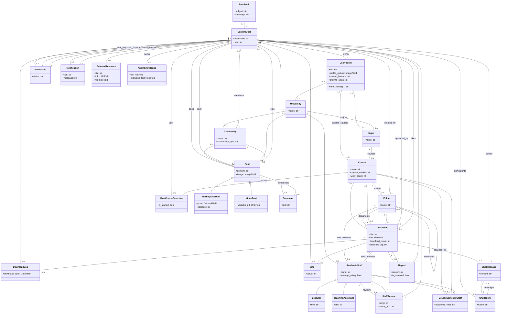

# 🚀 Student Drive - אינטליגנציה, ארכיטקטורה ומעקב


> **תקציר מנהלים:** קובץ זה נוצר ומתוחזק אוטומטית על ידי סוכן ה-AI. הוא ממפה את עץ הפרויקט, מציג תמונת מצב ויזואלית, ביקורת קוד מקיפה, ורשימת משימות אופרטיבית.

---

## 📑 תוכן עניינים
1. [🌳 עץ הפרויקט ותפקידי הקבצים](#-1-עץ-הפרויקט-ותפקידי-הקבצים)
2. [📈 תמונת מצב וציון בריאות](#-2-תמונת-מצב-וציון-בריאות)
3. [🗺️ מפת ארכיטקטורה (Visual Flowchart)](#-3-מפת-ארכיטקטורה-visual-flowchart)
4. [💡 ביקורת קוד אדריכלית](#-4-ביקורת-קוד-אדריכלית-code-review)
5. [✅ צ'ק-ליסט משימות](#-5-צק-ליסט-משימות-action-items)

---

## 🌳 1. עץ הפרויקט ותפקידי הקבצים

```
📂 student_drive/
    📄 build.sh
    📄 import_courses.py
    📄 manage.py
    📄 PROJECT_MIRROR.md
    📂 core/
        📄 adapters.py
        📄 admin.py
        📄 agent_brain.py
        📄 agent_views.py
        📄 ai_utils.py
        📄 apps.py
        📄 context_processors.py
        📄 forms.py
        📄 models.py
        📄 personal_drive.py
        📄 signals.py
        📄 student_agent.py
        📄 tests.py
        📄 utils.py
        📄 views.py
        📄 __init__.py
        📂 management/
            📄 __init__.py
            📂 commands/
                📄 load_bgu_courses.py
                📄 run_agent.py
                📄 seed_bgu_ee.py
                📄 __init__.py
        📂 static/
            📂 css/
            📂 js/
        📂 templates/
            📄 404.html
            📄 500.html
            📂 account/
                📄 login.html
                📄 logout.html
                📄 password_change.html
                📄 password_reset.html
                📄 signup.html
            📂 core/
                📄 accessibility.html
                📄 add_course.html
                📄 agent_report.html
                📄 agent_widget.html
                📄 analytics.html
                📄 base.html
                📄 change_password.html
                📄 chat_room.html
                📄 community_card_item.html
                📄 community_feed.html
                📄 complete_profile.html
                📄 course_detail.html
                📄 discover_communities.html
                📄 document_viewer.html
                📄 donations.html
                📄 feedback.html
                📄 friends_list.html
                📄 home.html
                📄 lecturers_index.html
                📄 login.html
                📄 notifications.html
                📄 personal_drive.html
                📄 privacy.html
                📄 profile.html
                📄 public_profile.html
                📄 register.html
                📄 search_results.html
                📄 settings.html
                📄 social_base.html
                📄 staff_detail.html
                📄 terms.html
                📂 partials/
                    📄 alert_banner.html
                    📄 collapsible_semester.html
                    📄 comment_item.html
                    📄 community_sidebar.html
                    📄 course_row.html
                    📄 doc_row.html
                    📄 post_card.html
                    📄 share_modal.html
                    📄 sorting_toolbar.html
            📂 socialaccount/
                📄 login.html
                📄 signup.html
    📂 documents/
    📂 locale/
        📂 en/
            📂 LC_MESSAGES/
    📂 student_drive/
        📄 asgi.py
        📄 settings.py
        📄 urls.py
        📄 wsgi.py
    📂 templates/
        📂 admin/
            📄 base_site.html
```

**תפקידי הקבצים המרכזיים:**

*   **`student_drive/` (תיקיית הפרויקט הראשי)**
    *   `manage.py`: כלי שורת הפקודה של ג'נגו. משמש להפעלת שרת הפיתוח, ביצוע מיגרציות, יצירת משתמשים ועוד.
    *   `build.sh`: סקריפט אוטומציה ככל הנראה לביצוע פעולות פריסה (Deployment), כמו איסוף קבצים סטטיים או הרצת פקודות ניהול.
    *   `import_courses.py`: סקריפט חיצוני לייבוא נתונים, כנראה קורסים, למסד הנתונים.
    *   `PROJECT_MIRROR.md`: קובץ Markdown המתעד את מצב הפרויקט, ייתכן שנוצר אוטומטית על ידי "המוח של הסוכן".
    *   `student_drive/settings.py`: קובץ התצורה הראשי של פרויקט ג'נגו. מגדיר מסד נתונים, אפליקציות מותקנות, הגדרות אבטחה, מיילים, סטטיק/מדיה, אימות משתמשים (Allauth), ואחסון ענן (S3). הוא משתמש במשתני סביבה (`.env`) לאבטחת מידע רגיש.
    *   `student_drive/urls.py`: קובץ ניתוב ה-URL הראשי של הפרויקט. מפנה את הבקשות השונות ל-URLconf הספציפי של כל אפליקציה.
    *   `student_drive/wsgi.py`: נקודת כניסה לשרתי ייצור התומכים ב-WSGI.
    *   `student_drive/asgi.py`: נקודת כניסה לשרתי ייצור התומכים ב-ASGI, מיועד בעיקר ל-WebSockets.
*   **`core/` (אפליקציית הליבה)**
    *   `core/models.py`: מגדיר את כל מודלי מסד הנתונים של האפליקציה: משתמשים (CustomUser, UserProfile), אקדמיה (University, Major, Course, AcademicStaff), קבצים (Folder, Document), קהילה (Community, Post, Comment), התראות (Notification), צ'אט (ChatRoom, ChatMessage) ועוד. מכיל לוגיקה לטיפול בקבצים (כיווץ תמונות) ו-signals ליצירת פרופילים אוטומטית. הוא הלב של המידע בפרויקט.
    *   `core/views.py`: מכיל את כל הלוגיקה העסקית והתצוגה. מטפל בבקשות HTTP, שולף ומעדכן נתונים ממסד הנתונים, מציג תבניות HTML, מנהל אינטראקציות חברתיות (חברים, לייקים, פוסטים, צ'אט), העלאת והורדת קבצים, חיפוש, הגדרות משתמש ועוד.
    *   `core/forms.py`: מגדיר טפסים לשימוש בממשק המשתמש, כמו הרשמה, יצירת קורס, העלאת מסמכים והשלמת פרופיל. כולל `BaseStyledModelForm` לסטיילינג אוטומטי.
    *   `core/admin.py`: רושם את מודלי האפליקציה לממשק הניהול של ג'נגו, ומאפשר ניהול נתונים קל למנהלים.
    *   `core/apps.py`: קובץ תצורה לאפליקציה, כולל הגדרת `ready()` לטעינת Signals.
    *   `core/adapters.py`: מכיל אדפטרים מותאמים אישית ל-django-allauth, המאפשרים התאמה אישית של תהליך ההרשמה וההתחברות (למשל, הפנייה להשלמת פרופיל).
    *   `core/context_processors.py`: מספק נתונים משותפים לכל התבניות (לדוגמה, ספירת התראות או פריטים כלליים).
    *   `core/signals.py`: מכיל פונקציות שמגיבות לאירועים ספציפיים במודלים (לדוגמה, יצירת פרופיל משתמש חדש לאחר הרשמה, הצטרפות אוטומטית לקהילות).
    *   `core/utils.py`: קובץ לפונקציות עזר כלליות, כמו כיווץ תמונות, אימות גודל קובץ, או לוגיקה לבדיקת הרשאות מחיקה.
    *   `core/ai_utils.py`: קובץ לפונקציות הקשורות לבינה מלאכותית, כמו יצירת סיכומים חכמים למסמכים.
    *   `core/management/commands/`: מכיל פקודות ניהול מותאמות אישית (לדוגמה, `load_bgu_courses.py` לטעינת קורסים, `seed_bgu_ee.py` ליצירת נתוני בדיקה).
    *   `core/templates/`: כל קבצי התבניות (HTML) של אפליקציית הליבה, מחולקים לתיקיות משנה לפי אזורים (account, core, partials).
    *   `core/static/`: קבצי CSS ו-JavaScript ספציפיים לאפליקציית הליבה.
*   **`documents/` (תיקיית Media)**: ככל הנראה תיקייה לאחסון קבצים שהועלו על ידי משתמשים (תמונות פרופיל, מסמכים, פוסטים), אם כי בהגדרות יש גם תמיכה ב-S3.
*   **`locale/`**: קבצי תרגום ותמיכה בריבוי שפות (כיום רק אנגלית ועברית).
*   **`templates/` (תיקיית Templates גלובלית)**
    *   `templates/admin/base_site.html`: קובץ תבנית לשינוי ממשק הניהול של ג'נגו.
    *   `templates/404.html`, `templates/500.html`: דפי שגיאה מותאמים אישית.

## 📈 2. תמונת מצב וציון בריאות

הפרויקט נראה מקיף, שאפתני ומתוכנן היטב בבסיסו. הוא כולל מגוון רחב של פיצ'רים (ניהול משתמשים, אקדמיה, קהילות, קבצים, צ'אט, התראות, ואפילו שילוב AI), מה שמצביע על פרויקט בעל היקף גדול ופוטנציאל רב. קיימת הפרדה סבירה של אחריויות בין המודלים, הוויואים והטפסים, ושימוש במנגנונים מתקדמים של ג'נגו כמו Signals ו-Custom Management Commands.

**ציון בריאות: 75/100**

**ניתוח מרכיבים:**

*   **נקיון קוד ומבנה (80/100):**
    *   **חוזקות:** מבנה תיקיות הגיוני, שימוש במודל משתמש מותאם אישית (`CustomUser`), שימוש נרחב ב-Signals ללוגיקה אוטומטית (יצירת פרופיל, הצטרפות לקהילות), טופס בסיס מעוצב (`BaseStyledModelForm`) שמפשט את ה-UI. קיימת חשיבה על מודולריות (adapters, ai_utils, utils). קבצי התבניות מאורגנים יפה.
    *   **חולשות:** יש קוד שחוזר על עצמו (DRY) כמו לוגיקת כיווץ תמונות בשיטות `save` שונות. ישנם קבצים ריקים או מושבתים (כמו `agent_views.py`, `student_agent.py`, ו-`agent_report` בוויואים) שדורשים ניקוי או השלמה.
*   **אבטחה (70/100):**
    *   **חוזקות:** שימוש ב-`.env` למשתני סביבה, הגדרות אבטחה בסיסיות ב-`settings.py` (Password Hashing, CSRF, XSS, HSTS ב-Production), וולידציה לגודל קובץ (`validate_file_size` - למרות יישום חלקי), סינון קלט (trim, strip) ב-views וב-forms.
    *   **חולשות:** וולידטור `validate_file_size` מוגדר אך לא מוטמע בפועל בשדה `Document.file.validators` (ריק). זה פותח פתח להתקפות מניעת שירות (DoS) על ידי העלאת קבצים גדולים במיוחד. ההסבר ב-`settings.py` לגבי `CSRF_COOKIE_HTTPONLY` והיחס ל-JS ב-`base.html` דורש בדיקה מעמיקה, ייתכן שיש שם פרצת אבטחה אם העקיפה אינה מבוקרת. הוספה ידנית של `new_lecturer_name` בטופס יצירת תיקייה יכולה ליצור סגל כפול אם לא מנוהלת היטב.
*   **ארכיטקטורה (75/100):**
    *   **חוזקות:** מודלי נתונים עשירים ומקושרים היטב, תמיכה באחסון קבצים בענן (S3), מנגנון התראות מבוסס מודל, מערכת רב-שכבתית (משתמשים, אקדמיה, קהילות, קבצים), מנגנון תגמולים במטבעות.
    *   **חולשות:** כמה מודלים עמוסים יתר על המידה (`UserProfile` במיוחד, אך גם `Document`), מה שיכול להקשות על תחזוקה. חסר תיעוד ברור יותר של זרימת נתונים או אינטראקציות מורכבות (למשל, איך מטבעות עוברים בין משתמשים). פוטנציאל לבעיות N+1 Queries בחלק מה-Views שלא עושים שימוש ב-`select_related`/`prefetch_related` (לדוגמה, בטעינת קורסים ב-`home` או `course_detail`).

לסיכום, הפרויקט בעל תשתית טובה וכולל מגוון יכולות מרשים. עם זאת, ישנם מספר אזורים, במיוחד בתחום האבטחה וה-DRY, הדורשים תשומת לב כדי להבטיח אמינות, יעילות וקלות תחזוקה לטווח הארוך.

## 🗺️ 3. מפת ארכיטקטורה (Visual Flowchart)



## 💡 4. ביקורת קוד אדריכלית (Code Review)

*   **🔴 קריטי (Security/Bugs)**
    *   **וולידציה חסרה לגודל קבצים:** הוולידטור `validate_file_size` מוגדר ב-`utils.py` ומיובא, אך אינו מופעל בפועל בשדה `file` של מודל `Document` (השדה מוגדר עם `validators=[]`). זהו חור אבטחה קריטי המאפשר העלאת קבצים בגודל בלתי מוגבל, שעלול להוביל להתקפות מניעת שירות (DoS) ולניצול משאבים (שטח אחסון, רוחב פס). **המלצה:** יש להוסיף את `validate_file_size` לרשימת ה-`validators` בשדה `Document.file`.
    *   **פוטנציאל ל-CSRF עוקף:** ההערה ב-`settings.py` לגבי `CSRF_COOKIE_HTTPONLY = True` ו"ה-JS ב-base.html עוקף את זה דרך ה-DOM" מעוררת חשש. אם קוד ה-JavaScript מצליח לגשת ל-CSRF טוקן למרות ההגדרה, זה אומר שההגנה אינה יעילה והפרויקט פגיע להתקפות CSRF. **המלצה:** יש לבדוק לעומק את מנגנון העקיפה. באופן כללי, `CSRF_COOKIE_HTTPONLY` אמור למנוע גישת JS. אם יש צורך בגישת JS לטוקן (למשל עבור בקשות AJAX), עדיף להעביר אותו כ-data attribute או Meta tag בצורה מבוקרת ולא לעקוף את ההגדרה בצורה פוטנציאלית לא בטוחה.
    *   **אי-התאמה בטיפול בקבצי צ'אט מועלים:** בפונקציה `chat_room`, בעת העלאת קובץ חדש מהמחשב (`local_file`), נוצר אובייקט `Document` עם `course=None`. לעומת זאת, בפונקציה `copy_file_to_my_drive`, קובץ מועתק מקבל את `course=original_doc.course`. זה יוצר חוסר עקביות: קבצים מועלים לצ'אט אינם משויכים לקורס כלשהו ונשארים "יתומים" מבחינת מבנה הקורסים, בעוד קבצים שמועתקים כן. יתרה מכך, הקו `Document.objects.create(...) course=original_doc.course` עלול ליצור `IntegrityError` אם הקורס המקורי לא קיים (למרות ש-`original_doc` נבדק ב-`get_object_or_404`). **המלצה:** להחליט על מדיניות אחידה: האם קבצים שאינם מועלים ישירות לקורס צריכים להיות עם `course=None` (עבור דרייב אישי בלבד) או תמיד להיות משויכים, ואז ליישם את זה באופן עקבי בכל מקומות ההעלאה/העתקה. כרגע, הדבר יכול להוביל לשגיאות לוגיות בניהול קבצים אישיים וציבוריים.

*   **🟡 שיפור ביצועים (Optimization)**
    *   **N+1 Queries בטעינת קורסים ומידע קשור:** בוויואים כמו `home` ו-`course_detail`, קיימת פוטנציאל לבעיות N+1 Queries. לדוגמה, כששולפים `Course` ואז ניגשים ל-`course.major.university.name` בתוך לולאה בתבנית, זה גורם ל-Query נפרד עבור כל קורס כדי לשלוף את המאפיין של ה-`Major` ו-`University`. **המלצה:** יש להשתמש ב-`select_related` עבור קשרי ForeignKey ו-`prefetch_related` עבור קשרי ManyToMany ב-QuerySets כדי לשלוף את כל הנתונים הנדרשים ב-Query אחד או שניים בלבד (לדוגמה: `Course.objects.filter(...).select_related('major__university')`).
    *   **כיווץ תמונות סינכרוני בשיטות `save`:** לוגיקת כיווץ התמונות ל-WebP מיושמת באופן סינכרוני בשיטות `save()` של מודלים רבים (`UserProfile`, `University`, `Document`, `Post`, `VideoPost`, `AcademicStaff`, `Feedback`). עבור קבצים גדולים, פעולה זו עלולה לחסום את תהליך השרת, להאט את זמני התגובה ולפגוע בחווית המשתמש. **המלצה:** להעביר את לוגיקת כיווץ התמונות למשימות אסינכרוניות (Background Tasks) באמצעות כלי כמו Celery. בדרך זו, המשתמש יקבל תגובה מהירה והכיווץ יתבצע ברקע.
    *   **שליפת חברים ב-`UserProfile.get_accepted_friends`:** הפרופרטי `get_accepted_friends` מבצע Query בתוך מתודה, מה שעלול להיות לא יעיל אם הוא נקרא פעמים רבות. **המלצה:** ניתן לשפר זאת על ידי שימוש ב-`prefetch_related` בעת שליפת `UserProfile` או על ידי יצירת מתודה יעילה יותר בשכבת המנהלים (Managers) של `Friendship` כדי לשלוף חברים.

*   **🟢 ניקיון קוד (Clean Code / DRY)**
    *   **שכפול קוד של כיווץ תמונות:** כפי שצוין בסעיף הביצועים, לוגיקת כיווץ תמונות חוזרת על עצמה במודלים רבים. זהו הפרה של עקרון DRY (Don't Repeat Yourself). **המלצה:** ליצור Mixin או Signal ייעודי (אולי ב-`core/signals.py` או `core/utils.py`) שיטפל בכיווץ תמונות אוטומטית לכל מודל שמכיל `ImageField` ודורש כיווץ. זה ירכז את הלוגיקה במקום אחד ויקל על תחזוקה.
    *   **שימוש ב-`get_user_model()` חוזר ונשנה:** הפונקציה `get_user_model()` מופעלת מספר פעמים ב-`core/views.py` (לדוגמה, ב-`global_search`, `public_profile`, `search_users`). **המלצה:** עדיף לייבא אותה פעם אחת בראש קובץ ה-views (או אף יותר טוב, במקום מרכזי יותר אם יש מספר קבצי views), ולאחסן את התוצאה במשתנה גלובלי או מקומי. לדוגמה: `from django.contrib.auth import get_user_model; User = get_user_model()`.
    *   **הגדרות `DEBUG` כפולות ב-`settings.py`:** קיימות הגדרות הקשורות לאבטחה (`SECURE_SSL_REDIRECT`, `SESSION_COOKIE_HTTPONLY`, `CSRF_COOKIE_HTTPONLY`) שמופיעות פעמיים ב-`settings.py`, פעם אחת כברירת מחדל ופעם שנייה בתוך בלוק `if not DEBUG:`. זה עלול להוביל לבלבול או אי-עקביות. **המלצה:** להגדיר את כל הערכים פעם אחת כברירת מחדל, ולאחר מכן לבצע Overwrite רק על אלה שמשתנים בבלוק `if not DEBUG:` או `if DEBUG:`.

## ✅ 5. צ'ק-ליסט משימות (Action Items)

- [ ] **תיקון וולידציה קריטית לגודל קבצים:** לוודא ש-`validate_file_size` מופעל בשדה `file` של מודל `Document` כדי למנוע העלאת קבצים גדולים מדי ומתקפות DoS.
- [ ] **אופטימיזציה של N+1 Queries ב-Views מרכזיים:** ליישם `select_related` ו-`prefetch_related` בוויואים `home` ו-`course_detail`, ובכל מקום נוסף שבו גישה לקשרים מתבצעת בתוך לולאות, כדי להפחית את מספר שאילתות מסד הנתונים.
- [ ] **העברת כיווץ תמונות למשימות רקע:** להעביר את לוגיקת כיווץ התמונות לפעולה אסינכרונית (למשל, באמצעות Celery) במקום ביצוע סינכרוני בשיטות `save()` של המודלים, כדי לשפר את זמני התגובה בעת העלאת קבצים.

---
*נבנה באהבה על ידי סוכן ה-AI שלך 🤖 | מופעל באמצעות Gemini 2.5 Flash*
