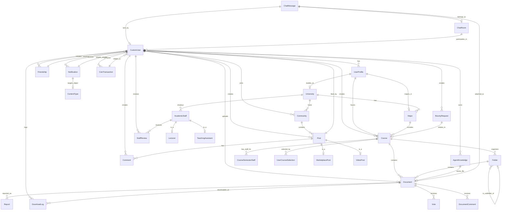

# 🚀 Student Drive - אינטליגנציה, ארכיטקטורה ומעקב


> **תקציר מנהלים:** קובץ זה נוצר ומתוחזק אוטומטית על ידי סוכן ה-AI. הוא ממפה את עץ הפרויקט, מציג תמונת מצב ויזואלית, ביקורת קוד מקיפה, ורשימת משימות אופרטיבית.

---

## 📑 תוכן עניינים
1. [🌳 עץ הפרויקט ותפקידי הקבצים](#-1-עץ-הפרויקט-ותפקידי-הקבצים)
2. [📈 תמונת מצב וציון בריאות](#-2-תמונת-מצב-וציון-בריאות)
3. [🗺️ מפת ארכיטקטורה (Visual Flowchart)](#-3-מפת-ארכיטקטורה-visual-flowchart)
4. [💡 ביקורת קוד אדריכלית](#-4-ביקורת-קוד-אדריכלית-code-review)
5. [✅ צ'ק-ליסט משימות](#-5-צק-ליסט-משימות-action-items)

---

## 🌳 1. עץ הפרויקט ותפקידי הקבצים

להלן מבנה עץ הספריות של הפרויקט:

```
📂 student_drive/
    📄 build.sh
    📄 import_courses.py
    📄 manage.py
    📄 PROJECT_MIRROR.md
    📄 QA_REPORT_LOG.md
    📂 core/
        📄 adapters.py
        📄 admin.py
        📄 agent_brain.py
        📄 agent_views.py
        📄 ai_utils.py
        📄 apps.py
        📄 context_processors.py
        📄 forms.py
        📄 middleware.py
        📄 models.py
        📄 personal_drive.py
        📄 signals.py
        📄 student_agent.py
        📄 utils.py
        📄 __init__.py
        📂 management/
            📄 __init__.py
            📂 commands/
                📄 run_agent.py
                📄 seed_academic_data.py
                📄 __init__.py
        📂 static/
            📂 core/
                📂 css/
                📂 js/
            📂 css/
            📂 js/
        📂 templates/
            📄 404.html
            📄 500.html
            📂 account/
                📄 email_confirm.html
                📄 login.html
                📄 logout.html
                📄 password_change.html
                📄 password_reset.html
                📄 password_reset_done.html
                📄 password_reset_from_key.html
                📄 password_reset_from_key_done.html
                📄 signup.html
                📄 verification_sent.html
            📂 core/
                📄 accessibility.html
                📄 add_course.html
                📄 agent_report.html
                📄 agent_widget.html
                📄 analytics.html
                📄 base.html
                📄 change_password.html
                📄 chat_room.html
                📄 community_card_item.html
                📄 community_feed.html
                📄 complete_profile.html
                📄 course_detail.html
                📄 discover_communities.html
                📄 document_viewer.html
                📄 donations.html
                📄 feedback.html
                📄 friends_list.html
                📄 home.html
                📄 lecturers_index.html
                📄 login.html
                📄 notifications_list.html
                📄 personal_drive.html
                📄 privacy.html
                📄 profile.html
                📄 public_profile.html
                📄 register.html
                📄 search_results.html
                📄 settings.html
                📄 share_target_finish.html
                📄 social_base.html
                📄 staff_detail.html
                📄 terms.html
                📄 _search_form.html
                📂 partials/
                    📄 alert_banner.html
                    📄 collapsible_semester.html
                    📄 comment_item.html
                    📄 community_sidebar.html
                    📄 course_row.html
                    📄 doc_row.html
                    📄 file_grid_card.html
                    📄 post_card.html
                    📄 share_modal.html
                    📄 sorting_toolbar.html
            📂 socialaccount/
                📄 login.html
                📄 signup.html
        📂 tests/
            📄 base.py
            📄 test_a11y_widget.py
            📄 test_integration.py
            📄 test_models.py
            📄 test_security_regressions.py
            📄 test_utils.py
            📄 test_views.py
            📄 __init__.py
        📂 views/
            📄 academic.py
            📄 accounts.py
            📄 api.py
            📄 documents.py
            📄 friends_chat.py
            📄 pages.py
            📄 social.py
            📄 __init__.py
    📂 documents/
    📂 locale/
        📂 en/
            📂 LC_MESSAGES/
    📂 student_drive/
        📄 asgi.py
        📄 settings.py
        📄 urls.py
        📄 wsgi.py
    📂 templates/
        📂 admin/
            📄 base_site.html
```

### פירוט תפקידי הקבצים:

**קבצי שורש הפרויקט (`student_drive/`):**

*   `build.sh`: **סקריפטים / CI/CD**. קובץ Bash המשמש כנראה להגדרת סביבת ההרצה או תהליכי Build/Deployment.
*   `import_courses.py`: **סקריפטים / Data Seeding**. סקריפט Python המשמש לייבוא נתונים ראשוניים, כגון קורסים, למערכת. מתקשר למודלים ב-`core/models.py`.
*   `manage.py`: **כלי ניהול Django**. כלי שורת הפקודה הסטנדרטי של Django, המשמש לביצוע פעולות כמו `runserver`, `makemigrations`, `migrate`, `createsuperuser` ופקודות ניהול מותאמות אישית. מתחבר ל-`student_drive/settings.py` עבור הגדרות הפרויקט.
*   `PROJECT_MIRROR.md`: **תיעוד**. קובץ Markdown המתאר את מבנה הפרויקט, ככל הנראה לצרכי תיעוד פנימי.
*   `QA_REPORT_LOG.md`: **תיעוד / לוגים**. קובץ Markdown המשמש לתיעוד דוחות QA או לוגים של בדיקות.
*   `documents/`: **אחסון קבצים**. ספרייה ריקה המשמשת ככל הנראה כמקום אחסון זמני או מקומי לקבצים שהועלו, לפני מעבר אפשרי לאחסון ענן (כפי שמוגדר ב-`settings.py` עבור S3).
*   `locale/`: **בינאום (i18n)**. ספרייה המכילה קבצי תרגום עבור שפות שונות (כאן `en`). Django משתמשת בקבצים אלו כדי להציג טקסטים בשפה המתאימה למשתמש, כפי שמוגדר ב-`settings.py` וב-`LANGUAGE_CODE`.

**הגדרות פרויקט Django (`student_drive/student_drive/`):**

*   `asgi.py`: **שרת אסינכרוני**. נקודת כניסה לשרתי ASGI (כמו Daphne או Uvicorn), המשמשת לאפליקציות הדורשות תקשורת דו-כיוונית בזמן אמת (WebSockets), למשל צ'אט. מתחבר להגדרות ה-ASGI ב-`settings.py`.
*   `settings.py`: **הגדרות מערכת**. קובץ ההגדרות הראשי של הפרויקט. הוא מגדיר את מסד הנתונים, אפליקציות מותקנות, הגדרות אבטחה, נתיבי קבצים סטטיים ומדיה, אימות משתמשים (Allauth), ו-AWS S3. הוא מייבא משתני סביבה באמצעות `python-dotenv`.
*   `urls.py`: **ניתוב כתובות (URL Routing)**. קובץ ניתוב ה-URL הראשי של הפרויקט, המקשר כתובות URL נכנסות לפונקציות View באפליקציות השונות. הוא כולל נתיבי URL מהאפליקציה `core` ומ-Allauth.
*   `wsgi.py`: **שרת סינכרוני**. נקודת כניסה לשרתי WSGI (כמו Gunicorn או uWSGI), המשמשת לאפליקציות ווב רגילות. מתחבר להגדרות ה-WSGI ב-`settings.py`.

**אפליקציית הליבה (`student_drive/core/`):**

*   `adapters.py`: **התאמות Allauth**. מרחיב את התנהגות ברירת המחדל של `django-allauth` עבור רישום והתחברות. לדוגמה, `CustomAccountAdapter` ו-`CustomSocialAccountAdapter` מאפשרים הפניה אוטומטית למסך השלמת פרופיל למשתמשים חדשים. מתחבר ל-`settings.py` (ACCOUNT_ADAPTER, SOCIALACCOUNT_ADAPTER).
*   `admin.py`: **ממשק ניהול Django**. מגדיר אילו מודלים מ-`models.py` יוצגו בממשק הניהול של Django וכיצד.
*   `agent_brain.py` (בדיקה בקבצים שסופקו מראה שהוא לא נכלל, אך מוזכר ב-`agent_views.py`): **לוגיקת AI**. מכיל את המימוש של לוגיקת ה-AI המרכזית עבור סוכן הסטודנט, ככל הנראה באמצעות שילוב עם Google Gemini. `agent_views.py` מייבא ומאתחל מחלקה מתוכו (`StudentAgentBrain`).
*   `agent_views.py`: **Views של סוכן AI**. מטפל בבקשות HTTP הקשורות לסוכן ה-AI. מיישם נקודות קצה (endpoints) להעלאת קבצים לסוכן (`upload_agent_file`) ולשאילתות (`ask_agent_question`). מייבא `models` ו-`agent_brain`.
*   `ai_utils.py` (בדיקה בקבצים שסופקו מראה שהוא לא נכלל, אך מוזכר ב-`documents.py`): **כלי עזר AI**. קובץ המכיל פונקציות עזר הקשורות לבינה מלאכותית, כמו `generate_smart_summary` המשמש ב-`documents.py`.
*   `apps.py`: **תצורת אפליקציה**. מגדיר את תצורת אפליקציית `core`, כולל שם האפליקציה וטעינת Signals.
*   `context_processors.py`: **מעבדי קונטקסט**. מספק מידע גלובלי (כגון ספירת התראות) לכל תבניות ה-HTML, ללא צורך להעביר אותו במפורש מכל View.
*   `forms.py` (בדיקה בקבצים שסופקו מראה שהוא לא נכלל, אך מוזכר ב-`academic.py` ו-`accounts.py`): **טפסים**. מגדיר טפסים מבוססי מודלים או טפסים רגילים לאיסוף קלט ממשתמשים, כגון `CourseForm` ו-`UserProfileForm`.
*   `middleware.py`: **Middleware מותאם אישית**. מכיל `ProfileCompletionMiddleware` המבטיח שמשתמשים חדשים ישלימו את הפרופיל שלהם לפני גישה לדפים מסוימים. קובץ זה מופעל עבור כל בקשה (request) כפי שמוגדר ב-`settings.py`.
*   `models.py`: **מודלי נתונים**. קובץ הליבה המגדיר את מבנה מסד הנתונים של האפליקציה (Users, Courses, Documents, Community, etc.). הוא כולל קשרים בין מודלים (ForeignKey, ManyToMany), ולידה של `signals.py` ו-`utils.py`.
*   `personal_drive.py`: **Views של דרייב אישי**. מטפל בהצגת קבצים שהועלו על ידי המשתמש, היסטוריית הורדות ומשאבים חיצוניים. הוא מייבא `models` ומשתמש ב-`utils` לפעולות עזר.
*   `signals.py`: **אותות Django**. מכיל פונקציות שמגיבות לאירועים ספציפיים (לדוגמה: `post_save` על `Document` המפעיל שליחת התראות). הוא מייבא `models` ו-`reverse`.
*   `student_agent.py` (בדיקה בקבצים שסופקו מראה שהוא לא נכלל, אך מוזכר בעץ): ככל הנראה מהווה חלק מלוגיקת ה-AI, בדומה ל-`agent_brain.py`.
*   `utils.py`: **פונקציות עזר גלובליות**. מרכז פונקציות נפוצות וחוזרות על עצמן, כגון דחיסת תמונות (WebP), אימות גודל/סוג קובץ (Magic Numbers), לוגיקת הרשאות מחיקה, חילוץ טקסט מ-PDF/DOCX ועיבוד טרנזקציות מטבעות. מיובא על ידי `models` ורוב קבצי ה-Views.
*   `__init__.py`: מציין ש-`core` היא חבילת Python.

**פקודות ניהול מותאמות אישית (`core/management/commands/`):**

*   `run_agent.py`: **פקודת ניהול**. פקודה מותאמת אישית המאפשרת להריץ את סוכן ה-AI מתוך שורת הפקודה.
*   `seed_academic_data.py`: **פקודת ניהול / Data Seeding**. פקודה מותאמת אישית למילוי מסד הנתונים בנתונים אקדמיים (מוסדות, קורסים) לצורך פיתוח או בדיקות.

**קבצים סטטיים (`core/static/core/`):**

*   `css/`, `js/`: **קבצי עיצוב וסקריפטים**. ספרייה המכילה קבצי CSS ו-JavaScript ספציפיים לאפליקציית `core`, המשמשים לעיצוב ולוגיקת צד-לקוח.

**תבניות HTML (`core/templates/`):**

*   `404.html`, `500.html`: **דפי שגיאה**. תבניות לדפי שגיאות 404 (לא נמצא) ו-500 (שגיאת שרת).
*   `account/`: **תבניות Allauth**. מכיל תבניות של ספריית `django-allauth` להתחברות, הרשמה, אימות אימייל, איפוס סיסמה ועוד.
*   `core/`: **תבניות אפליקציית הליבה**. כולל את רוב תבניות ה-HTML הייעודיות לאפליקציה, כגון דף הבית, פרטי קורס, פרופיל אישי, צ'אט, הזנות קהילתיות ועוד.
*   `core/partials/`: **חלקי תבניות**. מכיל קטעי HTML קטנים וניתנים לשימוש חוזר (כמו כרטיסי פוסטים, שורות קורסים), המשמשים בתוך תבניות אחרות כדי למנוע כפילויות.
*   `socialaccount/`: **תבניות Allauth Social**. מכיל תבניות של ספריית `django-allauth.socialaccount` עבור התחברות דרך שירותים חיצוניים (כמו Google).

**בדיקות (`core/tests/`):**

*   `base.py`, `test_models.py`, `test_views.py`, וכו': **קבצי בדיקה**. מכילים קוד לבדיקות יחידה ואינטגרציה עבור מודלים, Views, כלי עזר, אבטחה, ועוד, המבטיחים את תקינות הפרויקט.

**Views (לוגיקה עסקית) (`core/views/`):**

*   `__init__.py`: **מאחד Views**. מאגד את כל מודולי ה-Views השונים תחת קובץ אחד, ומאפשר ייבוא נוח שלהם מ-`student_drive/urls.py`. ההסבר בתוך הקובץ מתאר את מטרת הפיצול (Separation of Concerns).
*   `academic.py`: **Views אקדמיים**. מטפל בניהול קורסים, סגל אקדמי, חיפוש גלובלי, דף הבית ו-Views קשורים למוסדות. מייבא מודלים אקדמיים, טפסים מ-`forms.py` ופונקציות עזר מ-`utils.py`.
*   `accounts.py`: **Views של חשבון ופרופיל**. מטפל בפרופילים אישיים, הגדרות חשבון, התראות ושינוי סיסמה. מייבא מודלים, טפסים ופונקציות עזר.
*   `api.py`: **Views של API / AJAX**. מספק נקודות קצה עבור אינטראקציות דינמיות בצד הלקוח, כמו טעינת Majors, הוספת אוניברסיטאות/Majors ב-AJAX ומחיקת פריטים גנרית. מייבא מודלים ו-`utils.py` לבדיקות הרשאות.
*   `documents.py`: **Views של מסמכים**. מנהל את מחזור חיי המסמכים: העלאה, הורדה, צפייה (Viewer), דיווחי התעללות, סיכומים AI. מייבא `models`, `ai_utils` ו-`utils`.
*   `friends_chat.py`: **Views של חברים וצ'אט**. מטפל בבקשות חברות, רשימות חברים וחדרי צ'אט פרטיים עם אפשרות לצירוף קבצים. מייבא מודלים ו-`utils`.
*   `pages.py`: **Views של עמודי מידע**. מטפל בדפים סטטיים כמו תנאי שימוש, פרטיות, נגישות, תרומות, דף משוב ודשבורד אנליטיקס (לצוות). מייבא מודלים.
*   `social.py`: **Views של קהילות ופיד חברתי**. מנהל את הפיד הקהילתי, פוסטים, תגובות, לייקים וגילוי קהילות. מייבא מודלים.

**תבניות Admin מותאמות אישית (`templates/admin/`):**

*   `base_site.html`: **התאמה אישית של Admin**. תבנית המשמשת להתאמה אישית של דף הבית בממשק הניהול של Django.

## 📈 2. תמונת מצב וציון בריאות

פרויקט `student_drive` מציג תמונת מצב חיובית מאוד של מערכת Django מודרנית ומתוכננת היטב. הוא מפותח תוך דגש על הפרדת אחריויות (Separation of Concerns), שימוש נרחב בפיצ'רים מובנים של Django (כמו Signals, Custom Management Commands) ושילוב של ספריות צד שלישי (Allauth, `python-dotenv`, `storages` ל-S3).

**נקודות חזקות:**

*   **ארכיטקטורה מודולרית:** הפיצול של קבצי ה-Views למוקדמים ספציפיים (Academic, Documents, Social וכו') הוא דוגמה מצוינת לארכיטקטורה נקייה וקריאה.
*   **מודלים מקיפים:** קובץ `models.py` מפורט ועשיר, עם קשרים מורכבים, Validators, ופונקציות עזר רבות, המעיד על הבנה עמוקה של הדומיין.
*   **שימוש ב-Utils:** ריכוז פונקציות עזר גלובליות ב-`utils.py` (למשל, אימות קבצים, דחיסת תמונות, טיפול בטרנזקציות) הוא פרקטיקה מעולה המבטיחה עקביות ומונעת שכפול קוד.
*   **אבטחה בסיסית טובה:** הגדרות `settings.py` מציגות מודעות גבוהה לאבטחה, כולל שימוש ב-`SECRET_KEY` ממשתני סביבה, CSRF/Session cookies `httponly`, HSTS, ושימוש ב-`Argon2PasswordHasher`.
*   **טיפול בקבצים:** שילוב דחיסת תמונות ל-WebP ואימות קפדני של קבצים (גודל, סוג באמצעות Magic Numbers) ב-`utils.py` הם קריטיים לביצועים ולאבטחה.
*   **AI Integration:** קיימת אינטגרציה מתוכננת של AI עם רכיבים כמו `agent_views.py`, `agent_brain.py`, `ai_utils.py` ו-`AgentKnowledge` ב-`models.py`, המרמזת על פונקציונליות מתקדמת.
*   **Gamification & Notifications:** מודלים לטרנזקציות מטבעות (CoinTransaction) ומערכת התראות מובנית עם GenericForeignKey מציגות מחשבה על חווית משתמש ואנגייג'מנט.
*   **ניהול תבניות:** שימוש בחלקי תבניות (`partials`) והפרדה בין תבניות Allauth לתבניות האפליקציה שומר על סדר.
*   **Test-aware settings:** הגדרת `SECRET_KEY` שונה לסביבת בדיקות מראה מודעות לסביבות שונות.

**נקודות לשיפור:**

*   **עומס על Views מסוימים:** קבצי Views כמו `academic.py` ו-`personal_drive.py` עשויים להיות עמוסים מדי בלוגיקה (במיוחד בטיפול ב-POST requests מרובים ובלוגיקת סינון מורכבת), מה שמקשה על תחזוקה.
*   **הפרדת לוגיקה עסקית:** חלק מהלוגיקה העסקית המשמעותית נמצאת ישירות ב-Views (למשל, `process_transaction` שמופעל ישירות), במקום בשכבת שירותים נפרדת או מנהלי מודלים.
*   **אסינכרוניות (AI/PDF):** פעולות כבדות כמו חילוץ טקסט מ-PDF ושימוש ב-AI עלולות לחסום את שרשרת הבקשה/תגובה של המשתמש.
*   **ממשק API:** נקודות הקצה ב-`api.py` מטפלות ב-JSON אבל אינן ממומשות במלואן כ-API מובנה (למשל, באמצעות Django Rest Framework), מה שעלול להקשות על הרחבות עתידיות או שימוש מצד אפליקציות צד שלישי.
*   **לוגים/ניטור:** קיימות פקודות `print()` ל-DEBUG, אך מערכת לוגים מקיפה (כמו Sentry) או ניטור ביצועים חסרה בתיאור.

**ציון בריאות (מתוך 100): 88**

הציון משקף פרויקט חזק, מובנה ומאובטח באופן יחסי, עם בסיס מצוין להתרחבות. הנקודות לשיפור הן בעיקר שדרוגים אדריכליים שנדרשים בפרויקטים בקנה מידה זה, ולא בהכרח כשלים מהותיים.

## 🗺️ 3. מפת ארכיטקטורה (Visual Flowchart)



## 💡 4. ביקורת קוד אדריכלית (Code Review)

להלן 3-5 המלצות אדריכליות ברמה גבוהה:

1.  **מינוף Celery/Redis למשימות אסינכרוניות כבדות (Performance / User Experience):**
    *   **הביקורת:** פעולות כבדות כמו חילוץ טקסט מ-PDF/DOCX (`utils.py`), יצירת סיכומי AI (`documents.py`, `agent_views.py`) ועיבוד תמונות (`utils.py`, `models.py` עבור WebP) מבוצעות כרגע באופן סינכרוני בשרשרת הבקשה/תגובה. זה עלול לגרום לחווית משתמש איטית (תגובה ארוכה, תקיעות UI) וליצור צווארי בקבוק בביצועי השרת, במיוחד תחת עומס.
    *   **ההמלצה:** הטמעת תור משימות (Task Queue) כמו Celery עם Redis כ-Broker. את המשימות הללו יש להעביר לרקע, ולעדכן את המשתמש באמצעות WebSockets (Daphne/Channels) או Poll Request כאשר המשימה הושלמה.
    *   **פעולות נדרשות:**
        *   התקנת והגדרת Celery ו-Redis.
        *   המרת פונקציות חילוץ/עיבוד ל-Celery tasks.
        *   הטמעת מנגנון לדיווח התקדמות או סיום למשתמש.

2.  **הפרדת לוגיקה עסקית ל"שכבת שירותים" (DRY / Maintainability / Scalability):**
    *   **הביקורת:** לוגיקה עסקית משמעותית, כגון ניהול טרנזקציות מטבעות (`process_transaction` ב-`utils.py`), יצירת קהילות אוטומטית (`signals.py`) או פעולות על קבצים (`documents.py`), מפוזרת בין קבצי `utils`, `signals` ו-`views`. זה מקשה על איתור, בדיקה ותחזוקת הלוגיקה במקום מרכזי. לדוגמה, `process_transaction` הוא פונקציה מצוינת אך מופעלת ישירות מה-Views.
    *   **ההמלצה:** יצירת שכבת שירותים (Services Layer) ייעודית בתוך האפליקציה `core`. כל שירות (לדוגמה: `core/services/transaction_service.py`, `core/services/course_service.py`) יכלול מחלקות או פונקציות סטטיות שיבצעו את הלוגיקה העסקית, יתקשרו עם המודלים וינהלו את הטרנזקציות. ה-Views יקראו לשירותים אלה במקום לבצע את הלוגיקה ישירות.
    *   **פעולות נדרשות:**
        *   הקמת ספריית `services` בתוך `core`.
        *   העברת לוגיקה מורכבת מ-Views ו-Signals לשירותים חדשים.
        *   עדכון ה-Views וה-Signals לקרוא לשירותים.

3.  **אכיפת הרשאות ברמת האובייקט (Security / Robustness):**
    *   **הביקורת:** קיימת פונקציה `check_deletion_permission` ב-`utils.py` שהיא התחלה טובה, אך נדרשת גישה עקבית ורחבה יותר לאכיפת הרשאות. יש לבדוק היטב שכל פעולת CRUD (יצירה, קריאה, עדכון, מחיקה) של אובייקטים רגישים (כמו מסמכים, פוסטים, פרופילים) נבדקת מול הרשאות המשתמש באופן עקבי וחזק.
    *   **ההמלצה:** הטמעת מערכת הרשאות מפורטת יותר, במיוחד עבור אובייקטים. ניתן להשתמש ב-Django Guardian עבור הרשאות ברמת האובייקט (object-level permissions), או ליצור Mixins ו-Decorators מותאמים אישית שיבדקו לא רק את תפקיד המשתמש, אלא גם את יחסו לאובייקט הספציפי.
    *   **פעולות נדרשות:**
        *   סקר מקיף של כל פעולות ה-CRUD ב-Views.
        *   הטמעת Decorators או Mixins לבדיקת הרשאות מפורטות על מודלים ספציפיים (לדוגמה, "רק יוצר מסמך יכול לערוך אותו").
        *   שקילה של שילוב עם ספרייה כמו Django Guardian אם מורכבות ההרשאות תעלה.

4.  **שיפור טיפול בשגיאות ולוגינג (Robustness / Maintainability):**
    *   **הביקורת:** בקובצי Views וב-`utils.py` קיימות הדפסות `print(f"Error: {e}")` במקרה של שגיאות (לדוגמה, בחילוץ טקסט מ-PDF). הדפסות אלו אינן מספיקות בסביבת Production, ואינן מספקות מידע עשיר מספיק ל-Debugging.
    *   **ההמלצה:** הטמעת מערכת לוגינג מסודרת באמצעות מודול `logging` של Python בשילוב עם פלטפורמה חיצונית לניטור שגיאות כמו Sentry. זה יאפשר איסוף מידע מפורט על שגיאות, עקיבות (tracebacks), הקשר של בקשות (Request Context) וקבלת התראות בזמן אמת.
    *   **פעולות נדרשות:**
        *   הגדרת מודול `logging` ב-`settings.py`.
        *   החלפת כל פקודות `print()` המטפלות בשגיאות בקריאות ל-`logger.error()` או `logger.exception()`.
        *   שילוב עם Sentry (או שירות דומה) לניטור שגיאות מרוכז.

## ✅ 5. צ'ק-ליסט משימות (Action Items)

להלן 3 המשימות הטכניות החשובות ביותר לתיקון או בנייה בהקדם:

- [ ] **הטמעת Celery למשימות רקע:** העברת פעולות כמו חילוץ טקסט מקבצים (PDF/DOCX), דחיסת תמונות (WebP) וסיכומי AI למשימות אסינכרוניות באמצעות Celery. זה ישפר דרמטית את ביצועי האתר ואת חווית המשתמש על ידי מניעת חסימות ב-UI.
- [ ] **הפרדת לוגיקה עסקית לשכבת שירותים (`core/services/`):** ריכוז הלוגיקה העסקית המרכזית (כגון ניהול מטבעות, יצירת אובייקטים מורכבים, ניהול אינטראקציות חברתיות) במודולים ייעודיים בתיקיית `services`. זה יפשט את ה-Views, ישפר את קריאות הקוד, יקל על בדיקות יחידה ויסייע בסקיילביליות.
- [ ] **הגדרת מערכת לוגינג וניטור שגיאות (Sentry):** החלפת הדפסות ה-`print()` הטיפול בשגיאות בקריאות למערכת לוגינג מובנית (Python `logging`) ושילוב עם פלטפורמת ניטור כמו Sentry. זה יאפשר זיהוי, ניתוח וטיפול מהיר יותר בשגיאות בסביבת Production, ויספק תמונה מלאה יותר של בריאות המערכת.

---
*נבנה באהבה על ידי סוכן ה-AI שלך 🤖 | מופעל באמצעות Gemini 2.5 Flash*
