# 🚀 Student Drive - אינטליגנציה, ארכיטקטורה ומעקב


> **תקציר מנהלים:** קובץ זה נוצר ומתוחזק אוטומטית על ידי סוכן ה-AI. הוא ממפה את עץ הפרויקט, מציג תמונת מצב ויזואלית, ביקורת קוד מקיפה, ורשימת משימות אופרטיבית.

---

## 📑 תוכן עניינים
1. [🌳 עץ הפרויקט ותפקידי הקבצים](#-1-עץ-הפרויקט-ותפקידי-הקבצים)
2. [📈 תמונת מצב וציון בריאות](#-2-תמונת-מצב-וציון-בריאות)
3. [🗺️ מפת ארכיטקטורה (Visual Flowchart)](#-3-מפת-ארכיטקטורה-visual-flowchart)
4. [💡 ביקורת קוד אדריכלית](#-4-ביקורת-קוד-אדריכלית-code-review)
5. [✅ צ'ק-ליסט משימות](#-5-צק-ליסט-משימות-action-items)

---

## 🌳 1. עץ הפרויקט ותפקידי הקבצים

```
📂 student_drive/
    📄 build.sh
    📄 import_courses.py
    📄 manage.py
    📄 PROJECT_MIRROR.md
    📂 core/
        📄 adapters.py
        📄 admin.py
        📄 agent_brain.py
        📄 agent_views.py
        📄 ai_utils.py
        📄 apps.py
        📄 context_processors.py
        📄 forms.py
        📄 middleware.py
        📄 models.py
        📄 personal_drive.py
        📄 signals.py
        📄 student_agent.py
        📄 tests.py
        📄 utils.py
        📄 __init__.py
        📂 management/
            📄 __init__.py
            📂 commands/
                📄 load_bgu_courses.py
                📄 run_agent.py
                📄 seed_bgu_ee.py
                📄 __init__.py
        📂 static/
            📂 core/
                📂 css/
                📂 js/
            📂 css/
            📂 js/
        📂 templates/
            📄 404.html
            📄 500.html
            📂 account/
                📄 email_confirm.html
                📄 login.html
                📄 logout.html
                📄 password_change.html
                📄 password_reset.html
                📄 signup.html
                📄 verification_sent.html
            📂 core/
                📄 accessibility.html
                📄 add_course.html
                📄 agent_report.html
                📄 agent_widget.html
                📄 analytics.html
                📄 base.html
                📄 change_password.html
                📄 chat_room.html
                📄 community_card_item.html
                📄 community_feed.html
                📄 complete_profile.html
                📄 course_detail.html
                📄 discover_communities.html
                📄 document_viewer.html
                📄 donations.html
                📄 feedback.html
                📄 friends_list.html
                📄 home.html
                📄 lecturers_index.html
                📄 login.html
                📄 notifications.html
                📄 personal_drive.html
                📄 privacy.html
                📄 profile.html
                📄 public_profile.html
                📄 register.html
                📄 search_results.html
                📄 settings.html
                📄 social_base.html
                📄 staff_detail.html
                📄 terms.html
                📄 _search_form.html
                📂 partials/
                    📄 alert_banner.html
                    📄 collapsible_semester.html
                    📄 comment_item.html
                    📄 community_sidebar.html
                    📄 course_row.html
                    📄 doc_row.html
                    📄 post_card.html
                    📄 share_modal.html
                    📄 sorting_toolbar.html
            📂 socialaccount/
                📄 login.html
                📄 signup.html
        📂 tests/
            📄 test_economy.py
            📄 __init__.py
        📂 views/
            📄 academic.py
            📄 accounts.py
            📄 api.py
            📄 documents.py
            📄 friends_chat.py
            📄 pages.py
            📄 social.py
            📄 __init__.py
    📂 documents/
    📂 locale/
        📂 en/
            📂 LC_MESSAGES/
    📂 student_drive/
        📄 asgi.py
        📄 settings.py
        📄 urls.py
        📄 wsgi.py
    📂 templates/
        📂 admin/
            📄 base_site.html
```

**פירוט תפקידי הקבצים והתיקיות:**

*   **`student_drive/` (תיקיית הפרויקט הראשית):**
    *   **`build.sh`**: סקריפט Shell המשמש כנראה לבנייה, פריסה או הגדרת סביבת הפרויקט. מתחבר לתהליכי CI/CD או פריסה ידנית.
    *   **`import_courses.py`**: סקריפט פייתון עצמאי, ככל הנראה משמש לייבוא נתוני קורסים למסד הנתונים מתוך קובץ או מקור חיצוני. מתחבר למודלים של `Course`, `University`, `Major`.
    *   **`manage.py`**: כלי שורת הפקודה של Django. מאפשר לבצע פעולות כמו `runserver`, `makemigrations`, `migrate`, `createsuperuser` ופקודות מותאמות אישית. נקודת הכניסה לניהול הפרויקט.
    *   **`PROJECT_MIRROR.md`**: קובץ תיעוד, ככל הנראה מתאר את מבנה הפרויקט או שיקולים אדריכליים.

*   **`student_drive/student_drive/` (תיקיית הגדרות הפרויקט):**
    *   **`asgi.py`**: נקודת כניסה לשרת ASGI, משמשת לאפליקציות אסינכרוניות כמו WebSockets. מתחברת ל-Daphne או Uvicorn בסביבת פרודקשן.
    *   **`settings.py`**: ליבת ההגדרות של פרויקט Django. מגדיר את מסד הנתונים, אפליקציות מותקנות, Middleware, אבטחה, ניהול קבצים (S3), אימות (Allauth) ועוד. מתחבר כמעט לכל חלק בפרויקט.
    *   **`urls.py`**: קובץ ניתוב הראשי של הפרויקט. מאגד את ניתובים של אפליקציית `core` (וכל אפליקציה נוספת) לכתובות URL. מתחבר ל-`views` השונים.
    *   **`wsgi.py`**: נקודת כניסה לשרת WSGI, משמשת לאפליקציות סינכרוניות. מתחברת ל-Gunicorn או Apache/Nginx בסביבת פרודקשן.

*   **`student_drive/core/` (אפליקציית הליבה של הפרויקט):**
    *   **`adapters.py`**: מכיל קלאסים מותאמים אישית (Adapters) עבור `django-allauth`, המאפשרים להתאים אישית את תהליכי ההרשמה וההתחברות, לדוגמה הפנייה למסך השלמת פרופיל לאחר הרשמה חברתית. מתחבר ל-`settings.py` (ACCOUNT_ADAPTER, SOCIALACCOUNT_ADAPTER) ולמודלים `CustomUser`, `UserProfile`.
    *   **`admin.py`**: מגדיר את האופן שבו המודלים מוצגים ומנוהלים בממשק הניהול של Django. מתחבר ל-`models.py`.
    *   **`agent_brain.py`, `agent_views.py`, `ai_utils.py`, `student_agent.py`**: קבצים הקשורים למרכיב ה-AI Agent בפרויקט. `agent_brain.py` כנראה מכיל את הלוגיקה העיקרית של הסוכן, `agent_views.py` את ה-Views הקשורים, `ai_utils.py` כלי עזר כלליים ל-AI, ו-`student_agent.py` הגדרות ספציפיות לסוכן התלמיד. מתחברים ל-`models.py` (AgentKnowledge), ל-`views` ול-`settings.py` (GEMINI_API_KEY).
    *   **`apps.py`**: הגדרות ספציפיות לאפליקציית `core`.
    *   **`context_processors.py`**: פונקציות המוסיפות נתונים (קונטקסט) לכל תבנית HTML המרונדרת בפרויקט. לדוגמה, `global_counts` יכול לספק מידע גלובלי כמו מספר מסמכים או משתמשים. מתחבר ל-`settings.py` (TEMPLATES) ול-`models.py`.
    *   **`forms.py`**: מכיל את כל טפסי Django ליצירה ועדכון מודלים, אימות קלט משתמש, וכן לוגיקה לעיצוב אוטומטי של טפסים (BaseStyledModelForm). מתחבר ל-`models.py` ומשמש את ה-`views`.
    *   **`middleware.py`**: מכיל Middleware מותאם אישית, כמו `ProfileCompletionMiddleware` שמבטיח שמשתמשים חדשים ישלימו את הפרופיל שלהם לפני גישה לחלקים אחרים באתר. מתחבר ל-`settings.py` ולמודל `UserProfile`.
    *   **`models.py`**: הגדרת כל מודלי הנתונים (טבלאות מסד הנתונים) של האפליקציה, כולל קשרים בין מודלים, שיטות עזר וולידציה. זהו קובץ ליבה קריטי המתאר את המבנה הלוגי של כל הנתונים במערכת. מתחבר כמעט לכל קובצי ה-`forms.py`, `admin.py`, `views`, `signals.py`, ו-`utils.py`.
    *   **`personal_drive.py`**: קובץ ששמו מרמז על לוגיקה או Views ספציפיים הקשורים ל"דרייב אישי" של המשתמש. ככל הנראה מכיל Views או פונקציות עזר.
    *   **`signals.py`**: מכיל פונקציות שמגיבות לאירועים ספציפיים במערכת Django (לדוגמה, `post_save` לאחר שמודל נשמר). לדוגמה, יצירת `UserProfile` אוטומטית לאחר יצירת `CustomUser`. מתחבר ל-`models.py`.
    *   **`tests.py`**: קובץ המכיל בדיקות יחידה (unit tests) עבור לוגיקת האפליקציה `core`.
    *   **`utils.py`**: פונקציות עזר כלליות שאינן קשורות ישירות למודלים או Views, כמו דחיסת תמונות ל-WebP, חילוץ טקסט מקבצים ואימות גודל קובץ. משמשות מודלים (בפונקציות `save`), Views ו-Forms.
    *   **`management/`**: תיקייה עבור פקודות ניהול מותאמות אישית של Django.
        *   **`commands/`**: מכילה את קובצי הפקודות הספציפיות.
            *   **`load_bgu_courses.py`**: פקודת ניהול לטעינת נתוני קורסים של אוניברסיטת בן-גוריון.
            *   **`run_agent.py`**: פקודת ניהול להפעלת רכיב ה-AI Agent.
            *   **`seed_bgu_ee.py`**: פקודת ניהול לאכלוס ראשוני של נתונים (seed data) למסד הנתונים, ככל הנראה קורסים ספציפיים להנדסת חשמל באוניברסיטת בן-גוריון.

*   **`student_drive/core/static/`**: תיקייה לאחסון קבצים סטטיים (CSS, JavaScript, תמונות) הספציפיים לאפליקציית `core`.
    *   **`core/css/`, `core/js/`**: קבצי CSS ו-JS מותאמים אישית.

*   **`student_drive/core/templates/`**: תיקייה עבור תבניות HTML הספציפיות לאפליקציית `core`.
    *   **`account/`**: תבניות המותאמות אישית עבור `django-allauth` הקשורות לחשבון המשתמש (התחברות, הרשמה, איפוס סיסמה).
    *   **`core/`**: תבניות HTML עבור המסכים השונים של האפליקציה (דף הבית, פרטי קורס, פרופיל אישי ועוד).
    *   **`core/partials/`**: תבניות קטנות יותר המשמשות כחלקים הניתנים לשימוש חוזר בתבניות גדולות יותר (לדוגמה: כרטיס פוסט, שורת מסמך).

*   **`student_drive/core/views/`**: תיקייה המכילה את כל ה-Views (פונקציות או קלאסים שמטפלים בבקשות HTTP ומחזירים תגובות). החלוקה לקבצים נפרדים לפי נושאים משפרת את הסדר והמודולריות בתוך אפליקציית `core`.
    *   **`academic.py`**: Views הקשורים למוסדות אקדמיים, קורסים, סגל.
    *   **`accounts.py`**: Views הקשורים לניהול חשבונות משתמשים (למשל השלמת פרופיל, הגדרות).
    *   **`api.py`**: Views שמחזירים נתוני JSON, אולי עבור ממשקי API לשימוש צד לקוח (Frontend).
    *   **`documents.py`**: Views לטיפול במסמכים (העלאה, צפייה, הורדה, חיפוש).
    *   **`friends_chat.py`**: Views הקשורים למערכת החברים והצ'אט.
    *   **`pages.py`**: Views לדפים כלליים (דף הבית, אודות, תנאי שימוש).
    *   **`social.py`**: Views הקשורים לפיד החברתי, פוסטים, קהילות.

*   **`student_drive/documents/`**: תיקייה במערכת הקבצים המשמשת כברירת מחדל לאחסון קבצים שהועלו על ידי משתמשים (למשל מסמכים, תמונות פרופיל). זהו ה-`MEDIA_ROOT` בסביבת פיתוח מקומית.

*   **`student_drive/locale/`**: תיקייה עבור קבצי תרגום (Internationalization), המאפשרת לאתר לתמוך במספר שפות.

*   **`student_drive/templates/` (ברמת הפרויקט):**
    *   **`admin/base_site.html`**: תבנית המאפשרת התאמה אישית של דף הניהול הראשי של Django.

## 📈 2. תמונת מצב וציון בריאות

**סקירה כללית של הפרויקט:**
הפרויקט "Student Drive" נראה כפלטפורמה מקיפה לניהול תוכן אקדמי וקהילתי עבור סטודנטים. הוא כולל מערכת משתמשים מורכבת (עם תפקידים ופרופילים מפורטים), ניהול קורסים ומוסדות, מערכת קבצים וניהול תיקיות, פיד חברתי עם פוסטים ותגובות, מערכת דירוגים לסגל אקדמי, מרכיב של סוכן AI אישי (שכרגע מושבת), מערכת התראות, ואף מיני-מערכת כלכלית מבוססת "מטבעות". הפרויקט עושה שימוש נרחב ב-`django-allauth` לאימות, ומציג גישה מודרנית לפריסה (S3, Heroku/DigitalOcean) וביצועים (דחיסת תמונות ל-WebP). קיימת השקעה רבה בפרטי לוקליזציה (עברית) ו-UX (עיצוב אוטומטי לטפסים, השלמת פרופיל חובה).

**ציון בריאות: 75/100**

**ניתוח לפי קטגוריות:**

*   **ניקיון קוד ומבנה (Cleanliness & Structure):**
    *   **חוזקות:** יש תיעוד פנימי טוב בקבצים (docstrings), חלוקת Views לקבצים נפרדים באפליקציית `core/views` היא טובה ומסייעת למודולריות. השימוש ב-`BaseStyledModelForm` חכם ומפחית כפילויות בעיצוב. השימוש ב-`settings.py` עם משתני סביבה מסודר.
    *   **חולשות:** אפליקציית `core` גדולה ומונוליטית באופן משמעותי, וכוללת בתוכה תחומים רבים ובלתי קשורים. קובץ `models.py` הוא ענק ומכיל מעל 1,000 שורות, מה שמקשה על תחזוקה, קריאות וסיכוי גבוה לקונפליקטים במיזוג קוד. רכיבי ה-AI agent מושבתים אך עדיין נמצאים בקוד.
    *   **ציון:** 70/100

*   **אבטחה (Security):**
    *   **חוזקות:** `settings.py` מוגדר היטב עם שימוש במשתני סביבה עבור מפתחות סודיים, הפניית HTTPS חובה (בפרודקשן), הגדרות קוקיז ואבטחת סשנים, HSTS. אימות סיסמאות חזק. `django-allauth` תורם רבות לאבטחת אימות המשתמשים. קיימת ולידציית גודל קובץ (`validate_file_size`).
    *   **חולשות:** חסרה ולידציית תוכן/סוג קובץ מדויקת ב-`FileField` ו-`ImageField` מעבר לגודל וסיומת, מה שעלול לאפשר העלאת קבצים זדוניים עם סיומת מתאימה. לדוגמה, קובץ עם סיומת `.jpg` אך עם תוכן שאינו תמונה. יש לוודא שהפונקציות `extract_text_from_pdf` ו-`extract_text_from_docx` חסינות מ-DoS ואינן מעבדות קבצים זדוניים.
    *   **ציון:** 80/100

*   **מבנה ארכיטקטוני ויכולת הרחבה (Architecture & Scalability):**
    *   **חוזקות:** שימוש ב-`CustomUser` מאפשר גמישות רבה במודל המשתמש. ההפרדה בין `CustomUser` ל-`UserProfile` היא דפוס עיצוב טוב. ניהול קבצים באמצעות S3 (בפרודקשן) הוא קריטי לסילומיות. חלוקת Views לקבצים משפרת את הסדר.
    *   **חולשות:** כפי שצוין, אפליקציית `core` המונוליטית תפגע ביכולת הרחבה ובידוד תקלות. פעולות כבדות כמו דחיסת תמונות וחילוץ טקסט מתבצעות בתוך מתודות `save()` סינכרוניות, מה שיכול להוות צוואר בקבוק בביצועים ולפגוע בחווית המשתמש בהעלאות קבצים גדולות. קיימת פוטנציאל ל-N+1 queries במתודות כמו `UserProfile.get_accepted_friends`.
    *   **ציון:** 75/100

לסיכום, הפרויקט מציג יסודות חזקים עם תכונות מתקדמות רבות והקפדה על אבטחה בסיסית ו-UX, אך סובל מעומס על אפליקציית ה-`core` וקובץ `models.py` שלה, מה שמצריך ארגון מחדש כדי להבטיח תחזוקה ויכולת הרחבה לאורך זמן.

## 🗺️ 3. מפת ארכיטקטורה (Visual Flowchart)

```mermaid
classDiagram
    class CustomUser {
        +username: str
        +email: str
        +role: str
    }
    class UserProfile {
        +bio: str
        +profile_picture: ImageField
        +current_balance: int
        +lifetime_coins: int
        +referral_code: str
    }
    class University {
        +name: str
        +logo: ImageField
    }
    class Major {
        +name: str
    }
    class Course {
        +name: str
        +course_number: str
        +description: str
    }
    class Folder {
        +name: str
        +parent: Folder
    }
    class Document {
        +title: str
        +file: FileField
        +file_content: TextField
        +download_count: int
    }
    class ExternalResource {
        +title: str
        +link: URLField
        +file: FileField
    }
    class Community {
        +name: str
        +description: str
        +community_type: str
    }
    class Post {
        +content: str
        +image: ImageField
        +created_at: datetime
    }
    class MarketplacePost {
        +price: DecimalField
        +category: str
    }
    class VideoPost {
        +youtube_url: URLField
        +thumbnail: ImageField
    }
    class Comment {
        +text: str
    }
    class AcademicStaff {
        +name: str
        +email: EmailField
        +image: ImageField
    }
    class Lecturer
    class TeachingAssistant
    class StaffReview {
        +rating: int
        +review_text: str
    }
    class Report {
        +reason: str
        +description: str
    }
    class Feedback {
        +subject: str
        +message: str
    }
    class Notification {
        +title: str
        +message: str
        +notification_type: str
    }
    class CoinTransaction {
        +amount: int
        +transaction_type: str
    }
    class BountyRequest {
        +title: str
        +reward_amount: int
    }
    class UserCourseSelection {
        +is_starred: boolean
    }
    class ChatRoom
    class ChatMessage {
        +content: str
    }
    class DocumentComment {
        +text: str
    }
    class Friendship {
        +status: str
    }
    class DownloadLog {
        +download_date: datetime
    }
    class Vote {
        +value: int
    }
    class AgentKnowledge {
        +file: FileField
        +extracted_text: TextField
    }


    CustomUser "1" -- "1" UserProfile : owns
    CustomUser "1" -- "0..N" Friendship : sent_requests
    CustomUser "1" -- "0..N" Friendship : received_requests
    CustomUser "1" -- "0..N" Post : creates
    CustomUser "1" -- "0..N" Comment : creates
    CustomUser "1" -- "0..N" Report : creates
    CustomUser "1" -- "0..N" StaffReview : creates
    CustomUser "1" -- "0..N" Feedback : creates
    CustomUser "1" -- "0..N" Notification : receives
    CustomUser "1" -- "0..N" CoinTransaction : has
    CustomUser "1" -- "0..N" BountyRequest : creates
    CustomUser "1" -- "0..N" UserCourseSelection : selects
    CustomUser "1" -- "0..N" ChatRoom : participates
    CustomUser "1" -- "0..N" ChatMessage : sends
    CustomUser "1" -- "0..N" DocumentComment : creates
    CustomUser "1" -- "0..N" DownloadLog : logs
    CustomUser "1" -- "0..N" Vote : votes
    CustomUser "1" -- "0..N" AgentKnowledge : owns
    CustomUser "1" *-- "0..N" Community : joins (members)
    CustomUser "1" *-- "0..N" Document : likes
    CustomUser "1" *-- "0..N" Post : likes

    UserProfile --> University : studies_at
    UserProfile --> Major : majors_in
    UserProfile --> Course : favorite_courses (M2M)
    UserProfile --> CustomUser : referred_by

    University "1" -- "0..N" Major : has
    University "1" -- "0..N" Course : teaches
    University "1" -- "0..N" AcademicStaff : employs
    University "1" -- "0..N" Community : relates_to

    Major "1" -- "0..N" Course : offers

    Course "1" -- "0..N" Folder : has
    Course "1" -- "0..N" Document : contains
    Course "1" -- "0..N" UserCourseSelection : selected_by
    Course "1" -- "0..N" BountyRequest : relates_to

    Folder "1" -- "0..N" Folder : subfolders
    Folder "1" -- "0..N" Document : contains
    Folder --> CustomUser : created_by
    Folder --> AcademicStaff : staff_member

    Document --> Course : belongs_to
    Document --> Folder : belongs_to
    Document --> CustomUser : uploaded_by
    Document *-- CustomUser : likes
    Document "1" -- "0..N" Report : reported_by
    Document "1" -- "0..N" DownloadLog : logged_for
    Document "1" -- "0..N" Vote : voted_on
    Document "1" -- "0..N" DocumentComment : commented_on

    Post --> CustomUser : posted_by
    Post --> Community : posted_in
    Post --> University : posted_in
    Post *-- CustomUser : likes
    Post "1" -- "0..N" Comment : has

    MarketplacePost --|> Post : inherits
    VideoPost --|> Post : inherits

    Comment --> Post : comments_on
    Comment --> CustomUser : commented_by

    AcademicStaff --|> Lecturer : inherits
    AcademicStaff --|> TeachingAssistant : inherits
    AcademicStaff "1" -- "0..N" StaffReview : reviewed_by

    StaffReview --> AcademicStaff : reviews
    StaffReview --> CustomUser : reviewer

    Report --> Document : reports
    Report --> CustomUser : reporter

    Notification --> CustomUser : to_user
    Notification --> CustomUser : from_user

    CoinTransaction --> CustomUser : for_user

    ChatRoom "1" -- "0..N" ChatMessage : contains
    ChatMessage --> ChatRoom : in_room
    ChatMessage --> CustomUser : sent_by
    ChatMessage --> Document : attaches

```



## 💡 4. ביקורת קוד אדריכלית (Code Review)

*   **🔴 קריטי (Security/Bugs)**
    *   **המלצה**: **יישום ולידציית סוג קובץ חזקה (MIME Type Validation)**. כיום קיימת ולידציית גודל, אך חסרה בדיקה אמיתית של סוג הקובץ (MIME type) עבור קבצים המועלים ל-`Document` ולשדות `ImageField` אחרים. הסתמכות על סיומת קובץ בלבד (כמו בבדיקה `not self.file.name.endswith('.webp')`) אינה מספקת ועלולה לאפשר העלאת קבצים זדוניים (לדוגמה, סקריפט עם סיומת JPG) שעלול לנצל פרצות אבטחה בשרת או בצד הלקוח.
    *   **פעולה נדרשת**: השתמש בספריית צד שלישי כמו `python-magic` או ב-Django `FileExtensionValidator` בשילוב עם בדיקת `content_type` ב-`clean()` של הטופס או ב-`save()` של המודל כדי לוודא שסוג ה-MIME של הקובץ תואם לסיומת המצופה (למשל, `image/jpeg` עבור `.jpg`).

*   **🟡 שיפור ביצועים (Optimization)**
    *   **המלצה**: **אסינכרוניות לפעולות כבדות במתודות `save()`**. פעולות כמו דחיסת תמונות (`compress_to_webp`) וחילוץ טקסט מ-PDF/DOCX (`extract_text_from_pdf`, `extract_text_from_docx`) מתבצעות באופן סינכרוני בתוך מתודות `save()` של המודלים (`UserProfile`, `Document`, `Post`, `VideoPost`, `AcademicStaff`, `Feedback`). פעולות אלו חוסמות את ה-HTTP request ועלולות לגרום לזמני תגובה ארוכים, במיוחד עם קבצים גדולים או עומס משתמשים.
    *   **פעולה נדרשת**: העבר את הפעולות הכבדות האלה למשימות רקע אסינכרוניות (למשל, באמצעות Celery/Redis Queue, או אפילו משימות קרונ בסיסיות) שמופעלות באמצעות Django signals (`post_save`). כך ה-HTTP request יושלם במהירות, והעיבוד יבוצע ברקע.

*   **🟢 ניקיון קוד (Clean Code / DRY)**
    *   **המלצה**: **פירוק אפליקציית `core` המונוליטית לאפליקציות Django קטנות וממוקדות**. אפליקציית `core` מכילה מודלים, Views, Forms, Signals, Utilities ואף רכיבי AI עבור מגוון רחב של תחומי ליבה (משתמשים, אקדמיה, מסמכים, קהילה, התראות). הדבר מנוגד לעיקרון Single Responsibility Principle (SRP) ומקשה על הבנה, בדיקה, תחזוקה ושימוש חוזר בקוד.
    *   **פעולה נדרשת**: צור אפליקציות Django נפרדות עבור כל תחום מרכזי. לדוגמה: `users` (למשתמשים ופרופילים), `academic` (לאוניברסיטאות, קורסים, סגל), `documents` (למסמכים ותיקיות), `community` (לפוסטים, קהילות, תגובות), `notifications`, `economy`, `ai_agent` (אם יופעל). העבר את המודלים, Views, Forms וקבצים רלוונטיים לכל אפליקציה חדשה. עדכן את `settings.py` (INSTALLED_APPS), `urls.py` וייבואי קוד בהתאם.

*   **🟢 ניקיון קוד (Clean Code / DRY)**
    *   **המלצה**: **הימנע מכפילויות קוד במתודות `save()` עבור דחיסת תמונות**. הלוגיקה של `compress_to_webp` חוזרת על עצמה שוב ושוב במתודות `save()` של מודלים שונים (כמו `UserProfile`, `University`, `Post`, `VideoPost`, `AcademicStaff`, `Feedback`). זוהי הפרה מובהקת של עקרון DRY (Don't Repeat Yourself).
    *   **פעולה נדרשת**: צור Signal ייעודי (למשל, `post_save`) שיבדוק אם שדה מסוים במודל הוא `ImageField` שהשתנה, ורק אז יפעיל את `compress_to_webp`. או לחלופין, צור `mixin` למודלים שונים שיטפל בלוגיקה הזו. פתרון אלגנטי יותר הוא ליצור Storage backend מותאם אישית (לדוגמה, עבור S3) שידאג לדחוס תמונות באופן אוטומטי כששומרים אותן.

## ✅ 5. צ'ק-ליסט משימות (Action Items)

- [ ] הטמע ולידציית סוג קובץ חזקה (MIME Type Validation) עבור כל שדות `FileField` ו-`ImageField` בפרויקט כדי למנוע העלאת קבצים זדוניים.
- [ ] העבר את פעולות דחיסת התמונות וחילוץ הטקסט ממתודות `save()` סינכרוניות למשימות רקע אסינכרוניות (באמצעות Django Signals ו-Celery/RQ) כדי לשפר את ביצועי האתר וחווית המשתמש.
- [ ] פרק את אפליקציית ה-`core` המונוליטית למספר אפליקציות Django קטנות וממוקדות, כל אחת עם אחריות אחת (לדוגמה: `users`, `academic`, `documents`, `community`, `notifications`), כדי לשפר את המודולריות, הקריאות והתחזוקה של הפרויקט.

---
*נבנה באהבה על ידי סוכן ה-AI שלך 🤖 | מופעל באמצעות Gemini 2.5 Flash*
