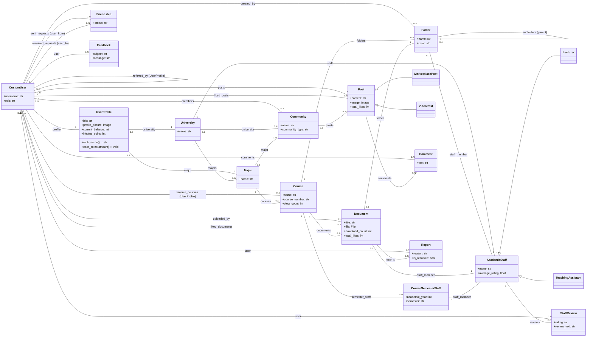

# 🚀 Student Drive - אינטליגנציה, ארכיטקטורה ומעקב


> **תקציר מנהלים:** קובץ זה נוצר ומתוחזק אוטומטית על ידי סוכן ה-AI. הוא ממפה את עץ הפרויקט, מציג תמונת מצב ויזואלית, ביקורת קוד מקיפה, ורשימת משימות אופרטיבית.

---

## 📑 תוכן עניינים
1. [🌳 עץ הפרויקט ותפקידי הקבצים](#-1-עץ-הפרויקט-ותפקידי-הקבצים)
2. [📈 תמונת מצב וציון בריאות](#-2-תמונת-מצב-וציון-בריאות)
3. [🗺️ מפת ארכיטקטורה (Visual Flowchart)](#-3-מפת-ארכיטקטורה-visual-flowchart)
4. [💡 ביקורת קוד אדריכלית](#-4-ביקורת-קוד-אדריכלית-code-review)
5. [✅ צ'ק-ליסט משימות](#-5-צק-ליסט-משימות-action-items)

---

## 🌳 1. עץ הפרויקט ותפקידי הקבצים

```
📂 student_drive/
    📄 build.sh
    📄 import_courses.py
    📄 manage.py
    📄 PROJECT_MIRROR.md
    📂 core/
        📄 adapters.py
        📄 admin.py
        📄 ai_utils.py
        📄 apps.py
        📄 context_processors.py
        📄 forms.py
        📄 models.py
        📄 tests.py
        📄 views.py
        📄 __init__.py
        📂 management/
            📄 __init__.py
            📂 commands/
                📄 load_bgu_courses.py
                📄 run_agent.py
                📄 seed_bgu_ee.py
                📄 __init__.py
        📂 static/
            📂 css/
            📂 js/
        📂 templates/
            📄 404.html
            📄 500.html
            📂 account/
                📄 login.html
                📄 logout.html
                📄 signup.html
            📂 core/
                📄 accessibility.html
                📄 add_course.html
                📄 agent_report.html
                📄 analytics.html
                📄 base.html
                📄 change_password.html
                📄 community_card_item.html
                📄 community_feed.html
                📄 complete_profile.html
                📄 course_detail.html
                📄 discover_communities.html
                📄 donations.html
                📄 feedback.html
                📄 friends_list.html
                📄 home.html
                📄 lecturers_index.html
                📄 login.html
                📄 privacy.html
                📄 profile.html
                📄 public_profile.html
                📄 register.html
                📄 search_results.html
                📄 settings.html
                📄 social_base.html
                📄 staff_detail.html
                📄 terms.html
                📂 partials/
                    📄 alert_banner.html
                    📄 collapsible_semester.html
                    📄 comment_item.html
                    📄 community_sidebar.html
                    📄 course_row.html
                    📄 doc_row.html
                    📄 post_card.html
                    📄 share_modal.html
                    📄 sorting_toolbar.
            📂 socialaccount/
                📄 login.html
                📄 signup.html
    📂 documents/
    📂 locale/
        📂 en/
            📂 LC_MESSAGES/
    📂 student_drive/
        📄 asgi.py
        📄 settings.py
        📄 urls.py
        📄 wsgi.py
    📂 templates/
        📂 admin/
            📄 base_site.html

```

**תפקידי הקבצים:**

*   **קונפיגורציה והגדרות בסיסיות של פרויקט ג'נגו (`student_drive/` - root ו-`student_drive/` - project config):**
    *   `student_drive/settings.py`: הלב של הפרויקט. מכיל את כל ההגדרות הגלובליות כמו הגדרות מסד נתונים, אפליקציות מותקנות, הגדרות אבטחה, מיילים, סטטיקה, וקונפיגורציה של `django-allauth` ו-`AWS S3`. הוא קורא משתני סביבה מה-.env.
    *   `student_drive/urls.py`: מפת הניתובים (URLs) הראשי של הפרויקט. מפנה בקשות נכנסות ל-`urls.py` של האפליקציה `core`.
    *   `student_drive/wsgi.py`: נקודת כניסה לשרתי ווב התומכים ב-WSGI (לסביבת פרודקשן).
    *   `student_drive/asgi.py`: נקודת כניסה לשרתי ווב התומכים ב-ASGI (לטיפול ב-WebSockets או משימות אסינכרוניות).
    *   `manage.py`: כלי שורת הפקודה של ג'נגו, משמש להרצת פקודות כמו `runserver`, `makemigrations`, `migrate` וכו'.
    *   `PROJECT_MIRROR.md`: קובץ Markdown המתעד את מבנה הפרויקט, ככל הנראה נוצר אוטומטית על ידי סקריפט AI.

*   **סקריפטים וכלים חיצוניים (`student_drive/` - root ו-`core/management/commands/`):**
    *   `build.sh`: סקריפט Shell שרץ ככל הנראה בתהליך ה-CI/CD (לדוגמה, ב-Render) ומבצע פעולות כמו `collectstatic`, `migrate`.
    *   `import_courses.py`: סקריפט Python חיצוני המשמש לייבוא קורסים למסד הנתונים, ככל הנראה מנתונים ראשוניים.
    *   `core/management/commands/`: תיקייה המכילה פקודות `manage.py` מותאמות אישית.
        *   `load_bgu_courses.py`: פקודת ניהול לטעינת נתוני קורסים של אוניברסיטת בן גוריון.
        *   `run_agent.py`: פקודת ניהול שמריצה "סוכן" (כנראה AI) שתפקידו לייצר את קובץ `PROJECT_MIRROR.md`.
        *   `seed_bgu_ee.py`: פקודת ניהול לשתילת נתונים ראשוניים (Seed Data) של המגמה להנדסת חשמל בבן גוריון.

*   **אפליקציית הליבה (`core/`):**
    *   `core/__init__.py`: הופך את התיקייה `core` למודול פייתון.
    *   `core/apps.py`: הגדרות יישום עבור אפליקציית `core`, כולל שם האפליקציה.
    *   `core/models.py`: מגדיר את כל מודלי מסד הנתונים של האפליקציה (משתמשים, פרופילים, אוניברסיטאות, קורסים, מסמכים, פוסטים, קהילות, דיווחים, סגל אקדמי וכו'). הוא כולל לוגיקה עסקית חשובה וקשרי גומלין בין המודלים. הוא מכיל גם `signals` ליצירת פרופיל משתמש אוטומטית.
    *   `core/views.py`: מכיל את כל פונקציות התצוגה (View Functions) שמטפלות בבקשות HTTP, שולפות נתונים מהמודלים, מפעילות לוגיקה עסקית ומחזירות תגובות (בדרך כלל Render של תבניות HTML או JsonResponse). קבצים אלה מתחברים למודלים ולטפסים.
    *   `core/forms.py`: מגדיר טפסים לשימוש במערכת (לדוגמה: יצירת קורס, השלמת פרופיל, העלאת מסמכים). משתמש ב-`BaseStyledModelForm` כדי לספק עיצוב אחיד. הוא מתחבר למודלים באמצעות `forms.ModelForm`.
    *   `core/admin.py`: רושם את מודלי האפליקציה לממשק הניהול של ג'נגו, ומאפשר למנהלים לנהל נתונים בקלות.
    *   `core/tests.py`: מכיל בדיקות יחידה ואינטגרציה עבור האפליקציה.
    *   `core/adapters.py`: מכיל קלאסים להתאמה אישית של התנהגות `django-allauth` (לדוגמה: הפניית משתמשים חדשים למסך השלמת פרופיל).
    *   `core/ai_utils.py`: מודול עבור פונקציונליות הקשורה לבינה מלאכותית, כמו `generate_smart_summary` (מוזכר ב-`views.py`).
    *   `core/context_processors.py`: קבצים המאפשרים להזריק נתונים נוספים לכל קונטקסט של תבנית, כמו `pending_reports_count`.

*   **משאבים סטטיים ותבניות (`core/static/`, `core/templates/`, `templates/` - root):**
    *   `core/static/css/`, `core/static/js/`: תיקיות המכילות קבצי CSS ו-JavaScript עבור האפליקציה, המשמשים לעיצוב ולוגיקת צד לקוח.
    *   `core/templates/core/`: מכילה את רוב תבניות ה-HTML עבור האפליקציה `core`.
        *   `base.html`: תבנית בסיסית שכל שאר התבניות יורשות ממנה, מגדירה את מבנה העמוד הכללי (האדר, הפוטר, ניווט).
        *   `home.html`, `course_detail.html`, `profile.html`, `community_feed.html` וכו': תבניות ספציפיות המציגות נתונים שונים למשתמשים.
        *   `core/templates/core/partials/`: מכילה חלקי תבניות קטנים שניתן לכלול בתבניות אחרות, לשימוש חוזר בקוד HTML.
    *   `core/templates/account/`, `core/templates/socialaccount/`: תבניות המותאמות אישית עבור `django-allauth` וחשבונות סוציאליים.
    *   `templates/404.html`, `templates/500.html`: תבניות ייעודיות להצגת שגיאות 404 ו-500.
    *   `templates/admin/base_site.html`: תבנית מותאמת אישית עבור ממשק הניהול של ג'נגו.

*   **בינאום (`locale/`):**
    *   `locale/en/LC_MESSAGES/`: תיקייה המכילה קבצי תרגום עבור בינאום (Internationalization) בשפה האנגלית.

*   **קבצים שהועלו (`documents/`):**
    *   `documents/`: תיקייה המשמשת לאחסון פיזי של מסמכים שהועלו על ידי משתמשים (אם כי בהגדרות S3, בפרודקשן קבצים אלה יישמרו בענן).

## 📈 2. תמונת מצב וציון בריאות

**סקירה כללית:**
הפרויקט "Student Drive" הוא פלטפורמת קהילה אקדמית מקיפה, המאפשרת למשתמשים (סטודנטים, מרצים) לשתף מסמכי קורסים, להצטרף לקהילות לפי מוסד/מסלול לימודים, לתקשר באמצעות פוסטים, לדרג אנשי סגל ולנהל פרופיל אישי. המערכת כוללת לוגיקה מורכבת של Role Based Access Control (RBAC), מערכת מטבעות/מוניטין, ויכולות AI לסיכום מסמכים. הפרויקט מתוכנן לפריסה בסביבת ענן (DigitalOcean/Render) עם תמיכה באחסון S3.

**ציון בריאות: 85/100**

*   **ניקיון קוד (Code Cleanliness):** (90/100)
    *   **חיובי:** הקוד מאורגן היטב באפליקציות, עם הפרדה ברורה בין Models, Views, Forms. השימוש ב-`BaseStyledModelForm` הוא דוגמה מצוינת לעקרון ה-DRY (Don't Repeat Yourself) ולניקיון קוד. יש תגובות מפורטות ומסודרות בעברית, מה שמקל מאוד על ההבנה. השימוש ב-`properties` במודלים (כמו `rank_name`, `total_likes`) הוא נכון ומוסיף בהירות.
    *   **פוטנציאל לשיפור:** חלק מפונקציות ה-`view` (לדוגמה `home`, `course_detail`, `community_feed`) ארוכות ומכילות לוגיקה רבה, שיכולה להיות מפוצלת לפונקציות עזר קטנות יותר או ל-Class-Based Views לצורך קריאות ותחזוקה טובה יותר. ישנן כמה פיסות לוגיקה כפולות (למשל תנאי השימוש בטפסים).

*   **אבטחה (Security):** (85/100)
    *   **חיובי:** יש שימוש במודל משתמש מותאם אישית (`CustomUser`), מה שמעניק גמישות ואבטחה טובה יותר. `settings.py` מראה הקפדה על עקרונות אבטחה רבים: `SECRET_KEY` ו-`DEBUG` נמשכים ממשתני סביבה, `ALLOWED_HOSTS` מוגדר היטב, יש שימוש ב-`SECURE_SSL_REDIRECT`, HSTS, `SESSION_COOKIE_HTTPONLY`, `CSRF_COOKIE_HTTPONLY`, ו-`X_FRAME_OPTIONS`. השילוב עם `django-allauth` ו-Google Social Auth הוא יציב ומאובטח.
    *   **פוטנציאל לשיפור:** הגדרת `ACCOUNT_EMAIL_VERIFICATION = "none"` ו-`SOCIALACCOUNT_EMAIL_VERIFICATION = "none"` מפחיתה באופן משמעותי את רמת האבטחה (והאמינות) של המשתמשים במערכת, שכן מיילים אינם מאומתים. במערכת כזו, אימות מייל הוא קריטי למניעת ספאם וזיוף. קוד ה-`generate_referral_code` אינו מבטיח ייחודיות אטומה, ויכול ליצור התנגשות בנפח גבוה.
    *   **חשוב לציין:** ה-`TODO` ב-`settings.py` לגבי `ALLOWED_HOSTS` הוא קריטי וצריך להיות מטופל לפני פריסה.

*   **מבנה (Structure):** (90/100)
    *   **חיובי:** מבנה הפרויקט ברור ומסודר, עם אפליקציית ליבה (`core`) אחת המכילה את רוב הלוגיקה. השימוש בתיקיות `management/commands` עבור סקריפטים אדמיניסטרטיביים הוא תקני ומצוין. מבנה התבניות (עם תיקיות `partials` ו-`account`/`socialaccount` עבור `allauth`) הוא הגיוני ומאפשר תחזוקה. הפרדת קבצי סטטיקה וקבצים שהועלו (Media) היא תקינה.
    *   **פוטנציאל לשיפור:** האפליקציה `core` מאוד גדולה ומכילה מודלים ולוגיקה רבים. ייתכן שפיצול לאפליקציות קטנות יותר (לדוגמה: `users`, `courses`, `community`, `files`) יקל על ניהול הפרויקט בקנה מידה גדול יותר בעתיד.

## 🗺️ 3. מפת ארכיטקטורה (Visual Flowchart)



## 💡 4. ביקורת קוד אדריכלית (Code Review)

*   🔴 **קריטי (Security/Bugs)** - סכנות אבטחה, קריסות אפשריות או שגיאות לוגיות חמורות.
    *   **אימות כתובת מייל (`settings.py`):** הגדרת `ACCOUNT_EMAIL_VERIFICATION = "none"` ו-`SOCIALACCOUNT_EMAIL_VERIFICATION = "none"` מהווה חולשת אבטחה ועלולה לאפשר למשתמשים להירשם עם כתובות מייל לא קיימות או שאינן שייכות להם. זה יכול להוביל לספאם, זיוף זהויות ובעיות אבטחה נוספות. יש לשנות להגדרה כמו `mandatory` או `optional` ולשלב תהליך אימות מייל מלא.
    *   **ייחודיות קוד הפניה (`models.py`):** הפונקציה `generate_referral_code` אינה מבטיחה ייחודיות אטומית של הקוד. במקרים נדירים, שני משתמשים יכולים לקבל את אותו קוד, וזה עלול לגרום ל-`IntegrityError` ב-DB בעת שמירה. יש לממש לולאה או מנגנון אחר שבודק את ייחודיות הקוד לפני השמירה, או להשתמש ב-UUIDs.

*   🟡 **שיפור ביצועים (Optimization)** - עומס על מסד הנתונים (N+1 queries), זמני טעינה איטיים.
    *   **שאילתות N+1 חוזרות (`profile`, `lecturers_index`, `course_detail`):** קיימות מספר שאילתות N+1 פוטנציאליות. לדוגמה:
        *   בפונקציה `profile`: `sum(d.total_likes for d in user_docs)` גורמת לכל איטרציה ב-`user_docs` לשלוף מחדש את הלייקים עבור אותו מסמך. עדיף להשתמש ב-`annotate` וב-`aggregate` ברמת השאילתה כדי לשלוף את הנתונים בפעם אחת.
        *   בפונקציה `lecturers_index`: `staff.privacy_name` ו-`staff.total_reviews` בלולאה על `staff_members`. `total_reviews` יוצר שאילתת ספירה נפרדת עבור כל איש סגל. יש לאחד זאת באמצעות `annotate(total_reviews=Count('reviews'))` על ה-queryset של `AcademicStaff`.
        *   בפונקציה `course_detail`: כאשר ניגשים לפרטי `staff_member` של `Folder` או `Document` בתבנית, ייתכן שיתרחשו שאילתות N+1. יש להוסיף `select_related('staff_member')` לשאילתות המתאימות.
    *   **לוגיקת `home` מורכבת:** פונקציית ה-`home` מכילה עץ לוגיקה מורכב עם תנאים מקוננים עבור חיפוש, ניווט לפי מוסדות/מסלולים, ותצוגת ברירת מחדל. אמנם פונקציונלית, היא עלולה להוביל לקריאות נמוכה וקושי בתחזוקה. פיצול הלוגיקה לפונקציות עזר קטנות יותר או שימוש במנגנונים כמו `match` (ב-Python 3.10+) יכול לשפר זאת.

*   🟢 **ניקיון קוד (Clean Code / DRY)** - חוב טכני, מניעת כפילויות, ארגון קוד.
    *   **פונקציות View ארוכות:** חלק מה-Views, ובפרט `course_detail` ו-`community_feed`, ארוכים ומכילים לוגיקה מרובה. פיצולן לפונקציות קטנות יותר או מעבר ל-Class-Based Views (CBV) יאפשר קריאות טובה יותר, שימוש חוזר בקוד וקלות בבדיקות.
    *   **כפילות תנאי השימוש בטפסים (`forms.py`):** הלוגיקה להוספת אישור תנאי השימוש (כולל ה-`mark_safe` והלינקים) מופיעה באופן כפול ב-`CustomSignupForm` וב-`UserProfileForm`. ניתן ליצור `Mixin` או `BaseForm` משותף שמכיל שדה זה כדי למנוע כפילויות.

## ✅ 5. צ'ק-ליסט משימות (Action Items)

- [ ] **הטמעת אימות כתובת מייל לכלל המשתמשים:**
    *   שנה את `ACCOUNT_EMAIL_VERIFICATION` ו-`SOCIALACCOUNT_EMAIL_VERIFICATION` ב-`settings.py` ל-`mandatory`.
    *   הגדר את `ACCOUNT_EMAIL_REQUIRED = True`.
    *   ודא שיש זרימת משתמשים ברורה לאימות מייל לאחר הרשמה/התחברות (ייתכן שידרשו שינויים קלים בתבניות `allauth`).
- [ ] **אופטימיזציה של שאילתות N+1 ב-Views מרכזיים:**
    *   ב-`profile` view, השתמש ב-`user_docs.annotate(total_likes_received=models.Sum('likes'))` במקום לולאה ידנית.
    *   ב-`lecturers_index` view, השתמש ב-`AcademicStaff.objects.annotate(total_reviews=models.Count('reviews'))` כדי לשלוף את נתוני הדירוגים ביעילות.
    *   ב-`course_detail` view, הוסף `select_related('staff_member', 'uploaded_by')` לשאילתות על `Folder` ו-`Document` כדי לצמצם גישות חוזרות ל-DB.
- [ ] **שיפור אבטחת קודי הפניה ובהירות AI:**
    *   עדכן את `generate_referral_code` ב-`models.py` כך שתבטיח ייחודיות מוחלטת לקוד הפניה (לדוגמה, על ידי לולאה שיוצרת קוד ובודקת את קיומו לפני שמירה, או שימוש ב-UUID).
    *   ב-`summarize_document_ai` ב-`views.py`, החלט סופית לגבי לוגיקת צריכת המטבעות (האם היא פעילה או לא פעילה) והסר את הקוד המבוטל או תקן אותו כך שישקף את הכוונה האמיתית.

---
*נבנה באהבה על ידי סוכן ה-AI שלך 🤖 | מופעל באמצעות Gemini 2.5 Flash*
